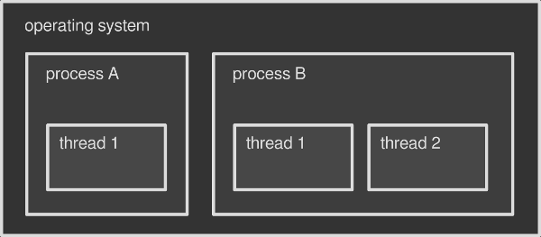

= 多线程简介: 一步一步走进并发的世界 
George Cao <matrix3456@gmail.com>
2020-02-20
:jbake-type: post
:jbake-status: published
:jbake-tags: 并行,并发,多线程
:idprefix:

.本系列中的其他文章
*  xref:introduction-to-thread-synchronization.adoc[线程同步简介] - 多线程应用中最常见的的并发控制方法之一
*  xref:lock-free-multithreading-with-atomic-operations.adoc[用原子操作实现无锁多线程] - 底层线程同步
*  xref:understanding-memory-reordering.adoc[理解内存重排序] - 为什写无锁多线程代码时它很重要

现代计算机有同时执行多个的能力。在高级硬件和更智能的操作系统的支持下，计算机的这个能力能够让你的程序在执行时间和响应速度两方面体现的更快。

开发利用这个能力的软件是有趣并且需要技巧的：它要求你理解计算机的底层细节。在本系列的第一篇文章中，我尝试浅显介绍一下线程（thread）。操作系统为执行此类魔法提供了很多工具，线程是其一。 

== 进程与线程：用正确的方式命名
现代操作系统能够同时执行多个程序。这就是你在用浏览器（一个程序）看这篇文章的同时还能够用多媒体播放器（另一个程序）听音乐的原因。每个程序就是一个正在被执行的进程（process）。操作系统知道很多技巧是的多个程序并行执行。更好的利用底层的硬件。不管那种方式，最终结果就是你感觉到所有的程序就是同时运行的。

在操作系统中运行多个进程不是同时执行多个命令的唯一办法。每个进程内部可以同时运行多个子任务，称之为线程。你可以把线程看作是进程的部分。 每个进程在启动时会至少会创建1个线程，这个线程叫做主线程。然后，根据程序或者程序员的需要，更多的线程会被启动或者中止。多线程技术是指在一个进程内运行多个线程。

例如，多媒体播放器可能是多线程的：1个线程负责绘制界面（通常是主线程），另1个线程则负责播放音乐，如此类推。

你可以把操作系统看作是包含了多个进程的容器。而每个进程则是包含了多个线程的容器。这篇文章中，我只会将重点放在线程上，但是整个主题是非常有趣的，在未来的文章会会有更深入的分析。

.操作系统可看作高包含多个进程的盒子，而进程则是包含了至少一个线程的盒子

=== 进程与线程的不同之处
每个进程都有操作系统为其分配的内存块。默认情况下，进程的内存块不能够和其他进程共享：你的浏览器是不能访问分配给多媒体播放器的内存块的，反之亦然。如果你运行一个程序的两个实例，规则也是一样的。比如你打开2个浏览器。操作系统把每个实例看作是一个新的拥有独立内存块的进程。所以，默认情况下，2个或者更多的进程之间没法共享数据，除非执行高级的技巧。这就是所谓的进程间通信（ https://en.wikipedia.org/wiki/Inter-process_communication[IPC] ）。

不像进程，线程则共享了操作系统分配给其所在进程的内存块：多媒体播放器的音频引擎可能很容易的访问播放器界面上的数据，反之亦然。因此线程间通信要比进程间通信容易多了。初次之外，线程通常比进程轻量：线程占用较少的资源并且创建速度更快，这也是线程被称为所谓的轻量级进程的原因。

线程是同时执行多个操作的更方便的办法。没有线程，你需要为每个任务写一个程序，然后按进程运行并且通过操作系统来同步这些进程。这样会更难（IPC需要技巧）而且慢（进程比线程更重量级）。

=== 绿色线程，或纤程
到目前为止，线程是操作系统级别的：一个进程启动一个线程需要和操作系统交互。并不是每种操作系统都原生支持线程。绿色线程，也称为纤程是一种在不支持线程的环境下通过软件模拟的多线程从而使的多线程程序能够工作。比如一个虚拟机可能会实现绿色线程以防底层依赖的操作系统不支持原生的线程。

绿色线程能够更快的创建和管理，因为绿色线程完全绕过了操作系统。但是也有其不足之处。我会在后续的文章中写这个主题。

『绿色线程』的名字是指90年代太阳微系统公司的内最初设计Java线程库的『绿色团队』。今天Java不在使用绿色线程了，2000年的时候Java从绿色现场切换到操作系统原生线程了。有部分其他语言（随便举几个例子Go，Haskell或者Rust）实现了原生线程对应的绿色线程。

== 线程用来干什么的
为啥一个进程要使用多个线程？ 如前所述，并行做事能够很大程度上的加快速度。比如你准备用电影编辑器渲染一部电源，电源编辑器能够智能的把渲染任务分散到多个线程，每个线程处理这部电影的一部分。所以如果单线程执行这个任务要话1小时，用2个线程可能只需要30分钟，用4个线程可能只需要15分钟，依此类推。

真的如此简单吗？有3个重要的点要考虑：

1. 并不是每个程序都需要多线程的。如果你的程序执行串行操作或者经常等待用户做一些事情，多线程可能并不会有多大好处；
2. 你不能不停的创建线程来让他运行更快：每个子任务都要仔细的思考和设计，才能执行并行操作。
3. 不能百分百的保证所有的线程是真正的平行执行的。也就是在某一时刻，是否真的并行取决于底层硬件。

最后一点比较关键：如果你的计算机不支持同时执行多个操作，那么操作系统就要模拟多线程。我们马上就会看到如何做了。 目前而言，让我们把并发(concurrency)认为是我们感觉多个任务在同时执行，而把真正的并行(parallelism)认为是多个任务真正的同时执行。

.并行是并发的子集。
image::images/concurrency-parallelism.png[Concurrency vs Parallelism]

== 并发和并行的背后原理
计算机中的中央处理单元(CPU)是真正负责运行程序的。 它有几部分构成，主要部分就是所谓的核（core）：所有的计算都是在核上执行的。一个核一次只能执行一个操作。

这当然也是一个主要缺点。 基于这个原因，操作系统发展出许多高级的技术才让用户能够一次运行多个进程（或者线程），特别是单核机器上的图形环境下。最重要的一个是抢占式多任务技术。其中抢占式是指操作能够中断当前正在运行的任务，切换到另一个任务并且一段时间之后还能够继续执行之前被中断的程序。

所以如果你的CPU是单核的，操作系统的部分工作就是将单核的算力分散给多个进程或者线程，这些进程或者线程是一个一个的循环执行的。这个操作会让你有个幻觉至少一个程序在并行运行，或者某个程序在同时做多个事情（如果是多线程程序的话）。并发是满足了，但是真正的平行，也就是同时运行多个进程的能力还是缺失的。

今天现代CPU有不止1个核，而且同一时刻，每个核都可以独立的执行操作。 拥有2个或者更多的核心意味着真正的并行是可能的。例如，我们的Intel Core i7是4核的：也就是说在某个时刻，它可以同时运行4个不同的进程或者线程。

操作系统能够检测到CPU的核数并且分配进程或者线程给每个单独的核。操作系统可以分配自己喜欢的任意的核给一个线程，并且这种类型的调度对正在运行的程序是完全透明的。

=== 多线程应用程序跑在单核上：有意义吗？
在单核机器上是不可能实现真正的并行的。 不过如果你的应用程序能从中获益的话，写一个多线程程序仍然是有意义的。当一个应用程序使用了多线程，抢占式多任务技术能够让该应用跑起来，那怕是其中有些线程执行的是很慢的或者阻塞的任务。

比如你正在开发一个桌面应用程序从非常慢磁盘上读出数据。如果你仅仅用单线程写这个程序，整个应用就会卡死，直到磁盘操作完成：被分配给唯一线程的CPU再等待磁盘唤醒的过程中完全浪费了。当然操作系统可以运行除此之外的其他程序，但是你的这个应用程序不会有任何响应了。

我们来用多线程重新考虑这个应用。 线程A负责磁盘读取，同时线程B负责主界面。如果线程A卡在等待很慢的设备，线程B仍然再运行主界面，这就能保证你的应用程序有响应。这是因为有2个线程的话，操作系统可以在2个线程之间切换CPU资源，这样就不用卡在那个慢的上。

== 线程越多，问题越多
如我们所知，线程会共享所在进程的内存块。这极大的简化了一个进程中2个或者多个线程之间交换数据。例如；一个电影编辑器可能持有了共享内存中包含视频时间线的一大部分。这部分共享内存会被多个用于渲染影片的工作线程访问。所有这些线程仅仅需要内存的一个句柄（比如指针）来读取数据并且将渲染后的帧写到磁盘上。

只要所有的线程都从内存中读取数据，程序就能够平滑运行。但是只要有一个线程写共享内存，同时其他线程读共享内存就会引起问题。在这种情况下会产生两种问题:

* 数据竞争 - 当一个写线程在修改内存的时候， 一个读线程可能正在读内存。 如果写线程没有完成写入， 读线程就会得的损坏的数据；
* 竞争条件 - 一个读线程只有在写线程写入数据之后才应该读数据。如果顺序反过来会怎样？比数据竞争更难理解，竞争条件是指2个或以上的线程以不可预知的顺序执行，事实上这些操作需要按照合适的顺序执行才能得到正确的结果。你的程序可触发竞争条件，即使是它已经有数据竞争保护。

=== 线程安全性的概念
我们说一段程序是线程安全的，是说这段程序能够正确工作，即使多个线程同时执行，也没有数据竞争或者竞争条件。你可能已经发现了一些程序类库声称自己是线程安全的：如果你正在写一个多线程程序，你要确保任何第三方函数可以在多个线程间调用而不会触发并发问题。

== 数据竞争的根本原因
我们知道一个CPU核某一时刻只能执行一条机器指令。 这种指令叫做原子的，因为他不能再细分了：它不能再细分为更小的操作了。『atom』在希腊语中是不可再分割的意思。

不能再细分的性质是的原子操作天然的线程安全的。当一个线程执行一个原子写数据操作，没有其他线程能够读到未完成的修改的数据。相反的，当一个线程执行一个原子读操作，它读出完整的数据。一个线程不能干扰一次原子操作，因此也不会有数据竞争发生。

坏消息是大部分操作都不是原子的。即使一个简单的赋值操作如 *x = 1* 在一些硬件上也可能是由多个原子机器指令组成的，这就造成了这个赋值语句本身不是一个原子操作。当一个线程读取 *x* 的值而另一个现在正在赋值就会触发数据竞争。

== 竞争条件的根本原因
抢占式多任务技术给了操作系统对线程管理的完全控制：根据高级调度算法，它可以启动，停止和暂停线程。作为程序员是控制不了程序执行的时间或者顺序的。事实上，没有任何保证如下这段简单的程序：

[source, c]
----
writer_thread.start()
reader_thread.start()
----

能够按照书写顺序依次启动2个线程。多运行几次这段程序，你就会发现他每次执行之间的不同表现：有时候写线程先启动，有时候确实杜线程先启动。如果你的程序需要写线程总是先于读线程启动，这就一定会触发竞争条件。

这个行为称为不确定性：每次执行的结果是变化的而且你不能预测到。调试竞争条件相关的程序是非常讨厌的，因为你不能在受控的环境下每次都重现此问题。

== 让线程和平共处：并发控制
数据竞争和竞争条件都是真实世界中的问题：一些人甚至是因此而丧命。协调2个或者更多并发线程的技术叫并发控制：操作系统和编程语言提供了处理并发控制的一些解决方案。最重要的方案如下：

* 同步 - 保证资源某一时刻只能被一个线程使用的方法。同步方法将特定代码块保护起来，使得2个或者更多的并发线程不能同时执行它，否则就会损坏你的共享数据；
* 原子操作 - 由于操作系统提供了一下特殊的指令，一批非原子操作（如上文提到的赋值操作）可以被转化为原子操作。这样的话共享数据总是有效的状态，不论其他线程如何访问它。
* 不可变数据 - 共享数据被标记为不可变的，谁都不能修改它：线程只允许读数据，消除了根本原因。 就我们所知线程可以安全从同样的内存读数据，只要数据不被修改。这也是函数式编程背后的主要哲学。

我会在这个关于并发的迷你系列的后续文章中覆盖所有有趣的主题，保持关注。

== 参考
* 8 bit avenue - https://www.8bitavenue.com/difference-between-multiprogramming-multitasking-multithreading-and-multiprocessing/[Difference between Multiprogramming, Multitasking, Multithreading and Multiprocessing]
* Wikipedia - https://en.wikipedia.org/wiki/Inter-process_communication[Inter-process communication]
* Wikipedia - https://en.wikipedia.org/wiki/Process_%28computing%29[Process (computing)]
* Wikipedia - https://en.wikipedia.org/wiki/Concurrency_%28computer_science%29[Concurrency (computer science)]
* Wikipedia - https://en.wikipedia.org/wiki/Parallel_computing[Parallel computing]
* Wikipedia - https://en.wikipedia.org/wiki/Multithreading_%28computer_architecture%29[Multithreading (computer architecture)]
* Stackoverflow - https://stackoverflow.com/questions/1713554/threads-processes-vs-multithreading-multicore-multiprocessor-how-they-are[Threads & Processes Vs MultiThreading & Multi-Core/MultiProcessor: How they are mapped?]
* Stackoverflow - https://stackoverflow.com/questions/19225859/difference-between-core-and-processor[Difference between core and processor?]
* Wikipedia - https://en.wikipedia.org/wiki/Thread_%28computing%29[Thread (computing)]
* Wikipedia - https://en.wikipedia.org/wiki/Computer_multitasking[Computer multitasking]
* Ibm.com - https://www.ibm.com/support/knowledgecenter/en/ssw_aix_71/generalprogramming/benefits_threads.html[Benefits of threads]
* Haskell.org - https://wiki.haskell.org/Parallelism_vs._Concurrency[Parallelism vs. Concurrency]
* Stackoverflow - https://stackoverflow.com/questions/16116952/can-multithreading-be-implemented-on-a-single-processor-system[Can multithreading be implemented on a single processor system?]
* HowToGeek - https://www.howtogeek.com/194756/cpu-basics-multiple-cpus-cores-and-hyper-threading-explained/[CPU Basics: Multiple CPUs, Cores, and Hyper-Threading Explained]
* Oracle.com - https://docs.oracle.com/cd/E19205-01/820-0619/geojs/index.html[1.2 What is a Data Race?]
* Jaka's corner - http://jakascorner.com/blog/2016/01/data-races.html[Data race and mutex]
* Wikipedia - https://en.wikipedia.org/wiki/Thread_safety[Thread safety]
* Preshing on Programming - https://preshing.com/20130618/atomic-vs-non-atomic-operations/[Atomic vs. Non-Atomic Operations]
* Wikipedia - https://en.wikipedia.org/wiki/Green_threads[Green threads]
* Stackoverflow - https://stackoverflow.com/questions/617787/why-should-i-use-a-thread-vs-using-a-process[Why should I use a thread vs. using a process?]

本文译自https://www.internalpointers.com/post/gentle-introduction-multithreading，英文读者可直接阅读原文。