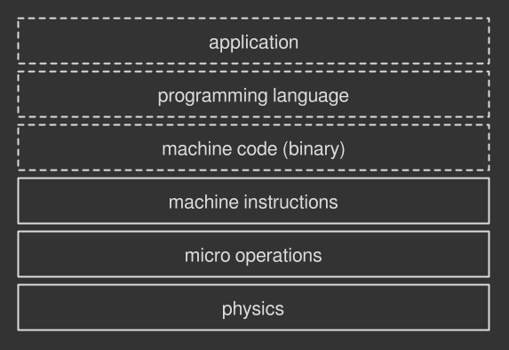
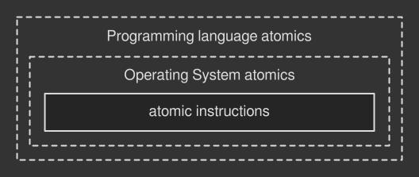
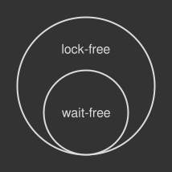

= Lock-free multithreading with atomic operations: Synchronizing threads at a lower level
George Cao <matrix3456@gmail.com>
:toc:
:sectnums:
:toc-title: 目录

Synchronizing threads at a lower level.

用原子操作实现无锁多线程：底层线程同步

.本系列中的其他文章
*  link:a-gentle-introduction-to-multithreading.adoc[多线程简介] - 一步一步走进并发的世界  
*  link:introduction-to-thread-synchronization.adoc[线程同步简介] - 多线程应用中最常见的的并发控制方法之一
*  link:lock-free-multithreading-with-atomic-operations.adoc[用原子操作实现无锁多线程] - 底层线程同步
*  link:understanding-memory-reordering.adoc[理解内存重排序] - 为什写无锁多线程代码时它很重要

This article has been carefully proofread by Federica Rinaldi. Thank you!

The Greek word "atom" (?τομο?; atomos) means uncuttable. A task performed by a computer is said to be atomic when it is not divisible anymore: it can't be broken into smaller steps.

"atom"在希腊语中拾不可再分割的意思。在计算机中一个任务被称为原子的是指他不能再细分了：它不能再拆分为更小的执行步骤了。

Atomicity is an important property of multithreaded operations: since they are indivisible, there is no way for a thread to slip through an atomic operation concurrently performed by another one. For example, when a thread atomically writes on shared data no other thread can read the modification half-complete. Conversely, when a thread atomically reads from shared data, it sees the value as it appeared at a single moment in time. In other words, there is no risk of data races.

原子操作是多线程操作的一个重要特征：因为原子操作操作拾不可在细分的，所以一个线程是不可能干扰另一个正在并发执行原子操作的线程的。例如，当一个线程原子写入共享数据，其他线程是没有办法读取到未完成的数据。相反的，当一个线程原子读取共享数据，这个数据就像是单个时间点上的数据。换句话说，就是没有数据竞争的风险。

In the previous chapter I have introduced the so-called synchronization primitives, the most common tools for thread synchronization. They are used, among other things, to provide atomicity to operations that deal with data shared across multiple threads. How? They simply allow a single thread to do its concurrent job, while others are blocked by the operating system until the first one has finished. The rationale is that a blocked thread does no harm to others. Given their ability to freeze threads, such synchronization primitives are also known as blocking mechanisms.

在上一篇文章中，我介绍了所谓的同步原语，也就是最常用的线程同步工具。他们是用来为多线程间处理共享数据的操作提供原子性的。怎么保证的？其实就是直接让单个线程执行并发任务，同时操作系统阻塞了其他线程直到第一个线程完成它的工作。这么做的原因是一个被阻塞的线程对其他线程是无害的。考虑到阻塞线程的能力，同步原语也称为阻塞机制。

Any blocking mechanism seen in the previous chapter will work great for the vast majority of your applications. They are fast and reliable if used correctly. However, they introduce some drawbacks that you might want to take into account:

上一篇文章中的任意一种阻塞机制对大多数应用来说能够很好的工作。如果能够正确的使用，他们也是快速的和可靠的。尽管如此，他们还是有一些你可能需要考虑的缺点：

. they block other threads — a dormant thread simply waits for the wakeup signal, doing nothing: it could be wasting precious time;
. 他们会阻塞其他线程 - 休眠的线程什么也不做，单纯的等待唤醒信号：这可能会浪费宝贵的时间；
. they could hang your application — if a thread holding a lock to a synchronization primitive crashes for whatever reason, the lock itself will be never released and the waiting threads will get stuck forever;
. 他们会卡死你的应用 - 如果一个持有同步原语锁的线程不管什么原因崩溃了，这个锁就永远不会释放了，等待这个锁的线程就永远卡住了；
. you have little control over which thread will sleep — it's usually up to the operating system to choose which thread to block. This could lead to an unfortunate event known as priority inversion: a thread that is performing a very important task gets blocked by another one with a lower priority.
. 你对休眠哪个线程没什么控制 - 通常是操作系统选择阻塞哪个线程。这会引发一个被称之为优先级反转的不幸结果： 一个执行非常重要任务的高优先级线程被一个低优先级线程阻塞了。

Most of the time you don't care about these issues as they won't affect the correctness of your programs. On the other hand, sometimes having threads always up and running is desirable, especially if you want to take advantage of multi-processor/multi-core hardware. Or maybe you can't afford a system that could get stuck on a dead thread. Or again, the priority inversion problem looks too dangerous to ignore.

大多数时候你不会关注这些问题，因为他们不影响你应用程序的正确性。另一方面，有时候使线程一直运行是需要的，特别是你想发挥多处理器/多核硬件的能力。或者你就是不能容忍系统被一个崩溃的线程拖死，或者优先级反转的问题不容忽视。

== Lock-free programming to the rescue
== 无锁编程来救场

The good news: there is another way to control concurrent tasks in your multithreaded app, in order to prevent points 1), 2) and 3) seen above. Known as lock-free programming or lockless programming, it's a technique to safely share changing data between multiple threads without the cost of locking and unlocking them.

好消息：还有另一种控制多线程应用中并发任务的方法，为了避免上面提到的1）,2）和3）点问题，称之为无锁编程，这是一种不用加锁和解锁就可以安全的在多线程之间共享变化的数据的技术。

The bad news: this is low-level stuff. Way lower than using the traditional synchronization primitives like mutexes and semaphores: this time we will get closer to the metal. Despite this, I find lock-free programming a good mental challenge and a great opportunity to better understand how a computer actually works.

坏消息：这是非常底层的东西。比传统的同步原语比如互斥锁和信号量还底层多了：这次我们会更接近真相。尽管如此，我发现无锁编程是一个很好的思想挑战，也是一个非常好的更好理解计算机如何工作的机会。

Lock-free programming relies upon atomic instructions, operations performed directly by the CPU that occur atomically. Being the foundation of lock-free programming, in the rest of this article I will introduce atomic instructions first, then I will show you how to leverage them for concurrency control. Let's get started!

无锁编程依赖原子指令，这是CPU直接执行的原子操作。原子指令作为无锁编程的基础，我将在本文剩下的部分首先介绍，然后展示如何利用它做并发控制。

== What are atomic instructions?
== 什么是原子指令？

Think of any action performed by a computer, say for example displaying a picture on your screen. Such operation is made of many smaller ones: read the file into memory, de-compress the image, light up pixels on the screen and so on. If you recursively zoom into one of those sub-tasks, that is if you break it down into smaller and smaller pieces, you will eventually reach a dead end. The smallest, visible to a human operation performed by a processor is called machine instruction, a command executed by the hardware directly.

思考计算中执行的任何操作，比如在屏幕上展示一张图片。这个操作是由许多更小的操作构成的：将文件读入内存，解压缩图片，点亮屏幕上的像素等等。如果你不停的细分这些更小的操作，也就是分为更小更小的操作，你最终会不能在分了。此时得到的处理器执行的肉眼可见的最小操作称之为机器指令，也就是硬件可直接执行的命令。

.计算机程序的不同层次。虚线代表软件层次，实线代表硬件层次。

Depending on the CPU architecture, some machine instructions are atomic, that is they are performed in a single, uncuttable and uninterruptible step. Some others are not atomic instead: the processor does more work under the hood in form of even smaller operations, known as micro-operations. Let's focus on the former category: an atomic instruction is a CPU operation that cannot be further broken down. More specifically, atomic instructions can be grouped into two major classes: store and load and read-modify-write (RMW).

取决于不同的CPU架构，一些机器指令是原子的，也就是单个的，不能切分的，不会被中断的。一些其他的指令则不是原子的：处理器私底下以更小的操作的方式做了更多的工作，这些操作称之为微指令。让我们给出更正式的分类：原子指令是不能在细分的CPU指令。更确切的说，原子指令可以被归为2个主要类型：存储与加载和读取-修改-写入（RMW）。

== Store and load atomic instructions
== 存储与加载原子指令

The building blocks any processor operates on: they are used to write (store) and read (load) data in memory. Many CPU architectures guarantee that these operations are atomic by nature, under some circumstances. For example, processors that implement the x86 architecture feature the MOV instruction, which reads bytes from memory and gives them to the CPU. This operation is guaranteed to be atomic if performed on aligned data, that is information stored in memory in a way that makes it easy for the CPU to read it in a single shot.

存储和加载是处理器都要操作的：用来写入（存储）和读取（加载）内存数据。在某些情况下，许多CPU架构保证这些操作是天然原子的。例如，实现了x86架构的处理器使用 *MOV* 指令从内存中读取数据并交给CPU。这个操作如果处理的是对齐的数据就能保证是原子的，对齐的数据是指以CPU能够很容易一次性读取出来的方式存储的数据。

== Read-modify-write (RMW) atomic instructions
== 读取-修改-写入(RMW)原子指令

Some more complex operations can't be performed with simple stores and loads alone. For example, incrementing a value in memory would require a mixture of at least three atomic load and store instructions, making the outcome non-atomic as a whole. Read-modify-write instructions fill the gap by giving you the ability to compute multiple operations in one atomic step. There are many instructions in this class. Some CPU architectures provide them all, some others only a subset. To name a few:

一些更复杂的操作不能够单独用一些简单存储和加载指令来完成。例如，增加存储中的数值需要至少3个原子的加载和存储指令，这就使的增加内存中数值这个操作不是原子的。读取-修改-写入（RMW）指令可以做到这个，也就有了通过一个原子操作完成多个操作的能力。除了RMW，还有非常多此类的指令。一些CPU架构全部提供，一些则提供一部分，下面列举一些：

* test-and-set — writes 1 to a memory location and returns the old value in a single, atomic step;
* 测试并设置 - 一个原子操作完成往内存中写入1并且返回赋值之前的值；
* fetch-and-add — increments a value in memory and returns the old value in a single, atomic step;
* 获取并增加 - 一个原子操作完成增加内存中的数值并且返回增加之前的值；
* compare-and-swap (CAS) — compares the content of a memory location with a given value and, if they are equal, modifies the contents of that memory location to a new given value.
* 比较并交互（CAS） - 比较内存中的数据和提供的数据，如果他们是相同的，将提供的数据写入该内存中。
All these instructions perform multiple things in memory in a single, atomic step. This is an important property that makes read-modify-write instructions suitable for lock-free multithreading operations. We will see why in few paragraphs.

以上这些操作都是一个原子操作完成多个操作。这是一个非常重要的特性，使得读取-修改-写入指令适合无锁多线程操作。我们很快就会看到为什么适合了。
 
== Three levels of atomic instructions
== 原子指令的三个层次

All the instructions seen above belong to the hardware: they require you to talk directly to the CPU. Working this way is obviously difficult and non-portable, as some instructions might have different name across different architectures. Some operations might not even exist across different processor models! So it is unlikely you will touch these things, unless you are working on very low-level code for a specific machine.

以上所有得这些指令都属于硬件层面的：他们直接和CPU交互。这要工作使非常困难并且不可移植，因为一些指令可能在不同得架构下叫不同得名字，一些指令在不同的处理器模型上则根本不存在！因此，你也不太可能用到这些，除非你在针对特定得机器写非常底层得代码。

Climbing up to the software level, many operating systems provide their own versions of atomic instructions. Let's call them atomic operations, since we are abstracting away from their physical machine counterpart. For example, in Windows you may find the Interlocked API, a set of functions that handle variables in an atomic manner. MacOS does the same with its OSAtomic.h header. They surely conceal the hardware implementation, but you are still bound to a specific environment.

上到软件层面，许多操作系统提供了各自的原子指令。姑且称之为原子操作(atomic operations)，因为我们将抽象出物理机器指令对应得原子操作。 例如， Windows系统上可能会用到Interlocked API，这是一组原子方式处理变量得函数。 MacOS则用OSAtomc.h头文件提供的函数做同样的事情。他们肯定是使隐藏了硬件的实现，但是你还是受限于一个特定的环境。

The best way to perform portable atomic operations is to rely upon the ones provided by the programming language of choice. In Java for example you will find the java.util.concurrent.atomic package; C++ provides the std::atomic header; Haskell has the Data.Atomics package and so on. Generally speaking, it is likely to find support for atomic operations if a programming language deals with multithreading. This way is up to the compiler (if it's a compiled language) or the virtual machine (if it's an interpreted language) to find the best instructions for implementing atomic operations, whether from the underlying operating system API or directly from the hardware.

实现可移植原子操作的最好办法是使用你所选择的编程语言提供的原子操作。比如Java语言中有 *java.util.concurrent.atomic* 包；C++提供了 *std::atomic* 头文件； Haskell有 *Data.Atomics* 包等等。一般来讲，如果一个编程语言能处理多线程，那就很有可能会提供原子操作的支持。这样的话就是编译器（如果是编译语言）或者虚拟机（如果是解析语言）负责从底层操作系统API或者硬件中找到最合适的指令来实现原子操作。 

.原子指令和操作的层级。虚线代表软件层次，实线代表硬件层次。

For example, GCC — a C++ compiler — usually transforms C++ atomic operations and objects straight into machine instructions. It also tries to emulate a specific operation that doesn't map directly to the hardware with other atomic machine instructions if available. The worst-case scenario: on a platform that doesn't provide atomic operations it may rely upon other blocking strategies, which wouldn't be lock-free, of course.

例如，C++ 的编译器GCC通常是直接将 C++ 语言的原子操作和对象对应到机器指令。如果不能直接映射到硬件上，它也会利用其他可用的原子操作来实现特定操作。最坏情况下，在一个不提供原子操作的平台上，它可能利用其他阻塞策略了，当然了这肯定不是无锁的实现。

== Leveraging atomic operations in multithreading
== 在多线程中使用原子操作

Let's now see how atomic operations are used. Consider incrementing a simple variable, a task that is not atomic by nature as it is made of three different steps — read the value, increment it, store the new value back. Traditionally, you would regulate the operation with a mutex (pseudocode):

我们现在看看原子操作是如何使用的。 考虑增加一个简单的变量，这是本来就不是原子操作，因为此操作由3个不同的步骤构成：读取数值，给数值加1，将结果写回。 一般来说，你可能会使用互斥锁来正确实现这个操作（伪代码）：

[source, c]
----
mutex = initialize_mutex()
x     = 0

reader_thread()
    mutex.lock()
    print(x)
    mutex.unlock()

writer_thread()
    mutex.lock()
    x++
    mutex.unlock()
----
The first thread that acquires the lock makes progress, while others sit and wait in line until it has finished.

首先获得互斥锁的线程会继续执行，而其他线程则等待第一个线程执行完毕。

Conversely, the lock-free approach introduces a different pattern: threads are free to run without any impediment, by employing atomic operations. For example:

相反的，无锁方案使用了不同的模式：通过原子操作，线程可以随意执行而不用阻塞，例如：

[source,c]
----
x = 0

reader_thread()
    print(load(x))

writer_thread()
    fetch_and_add(x, 1)
----
I assume that fetch_and_add() and load() are atomic operations based on the corresponding hardware instructions. As you may notice, nothing is locked here. Multiple threads that call those functions concurrently can all make progress. The atomicity of load() makes sure that no reader thread will read the shared value half-complete, as well as no writer thread will damage it with a partial write thanks to fetch_and_add().

我假设了 *fetch_and_add()* 和 *load()* 是基于相应的硬件指令的原子操作。 你可能已经发现了，这里并没有使用锁。 并发调用这些函数的多个线程都可以继续执行。*load()* 函数的原子性将保证不会有读线程读取到未完成修改的数据，同时因为 *fetch_and_add()* 的原子性，也不会有写线程能够部分修改数据。

== Atomic operations in the real world
== 现实世界中的原子操作

Now, this example reveals us an important property of atomic operations: they work only with primitive types — booleans, chars, shorts, ints and so on. On the other hand, actual programs require synchronization for more complex structures like arrays, vectors, objects, vectors of arrays, objects containing arrays, ... . How can we guarantee atomicity on such convoluted entities with simple operations based on primitive types?

现在，上面这个例子显示了原子操作的一个重要特性：他们仅针对原子类型，如boolean型，字符串，整数等。但是真的程序是需要使用同步技术来实现更负责的数据，比如数组，向量，对象，数据向量，对象里包含数据等等。如何用基于原子类型的简单操作来保证负责数据的原子性？

Lock-free programming forces you to think out of the box of the usual synchronization primitives. You don't protect a shared resource with atomic operations directly, as you would do with a mutex or a semaphore. Rather, you build lock-free algorithms or lock-free data structures, based on atomic operations to determine how multiple threads will access your data.

无锁编程迫使你跳出常规的同步原语来思考问题。你不用直接用原子操作保护共享资源，而是用互斥锁或者信号量。同样的，你会基于原子操作构建无锁算法或者无锁数据结构来确定多个线程如何访问你的数据。

For example, the fetch-and-add operation seen before can be used to make a rudimentary semaphore that, in turn, you would employ to regulate threads. Not surprisingly all the traditional, blocking synchronization entities are based on atomic operations.

例如，上面看到的 *fetch-and-add* 操作可以用来实现一个基本的信号量，而这个信号量就可以用来协调多个线程。毫无意外，所有传统的阻塞同步工具都是基于原子操作的实现的。

People have written countless lock-free data structures like Folly's AtomicHashMap, the Boost.Lockfree library, multi-producer/multi-consumer FIFO queues or algorithms like read-copy-update (RCU) and Shadow Paging to name a few. Writing these atomic weapons from scratch is hard, let alone making them work correctly. This is why most of the time you may want to employ existing, battle-tested algorithms and structures instead of rolling your owns.

人们写了很多个无锁数据结构，比如Folly的 *AtomicHashMap*，*Boost.Lockfree类库*，多生产者/多消费者先进先出队列，或者诸如读取-复制-更新（RCU）和阴影分页等一些算法。从头开始写这些原子工具很困难，更不用说让他们正确工作。这也是大多数时候你可能会使用已经存在的，实战检验过得算法与数据结构，而不是使用自习实现的。

== The compare-and-swap (CAS) loop
== 比较并交换(CAS)循环

Moving closer to real-world applications, the compare-and-swap loop (a.k.a. CAS loop) is probably the most common strategy in lock-free programming, whether you are using existing data structures or are writing algorithms from the ground up. It is based on the corresponding compare-and-swap atomic operation and has a nice property: it supports multiple writers. This is an important feature of a concurrent algorithm especially when used in complex systems.

具体到实际应用，比较并交换循环(CAS loop)可能是无锁编程中最常用的技巧，无论你是使用现成的数据结构或者从头开始实现算法。这是基于对应的 *比较并交换* 原子操作（CAS）而且有一个很好的特点：他能支持多个写线程。这是用到复杂系统中的并发算法的一个重要特征。

The CAS loop is interesting also because it introduces a recurring pattern in lock-free code, as well as some theoretical concepts to reason about. Let's take a closer look.

CAS循环非常有趣是因为他在无锁代码中引入了重复模式，同时引入了用于推理的理论概念。我们进一步看一下。

== A CAS loop in action
== CAS循环实现

A CAS function provided by an operating system or a programming language might look like this:

操作系统或者编程语言提供的CAS函数可能张这个样子：
[source,c]
----
boolean compare_and_swap(shared_data, expected_value, new_value);
----
It takes in input a reference/pointer to some shared data, the expected value it currently takes on and the new value you want to apply. The function replaces the current value with the new one (and returns true) only if the value hasn't changed, that is if shared_data.value == expected_value.

他的入参有共享数据的引用/指针，预期共享数据当前的值以及将要赋值的新值。这个函数只有在
[source,c]
----
shared_date.value == expected_value
----
的情况下才会使用新数据替换原始数据，并且只用数据改变的情况下才返回true。

In a CAS loop the idea is to repeatedly trying to compare and swap until the operation is successful. On each iteration you feed the CAS function with the reference/pointer, the expected value and the desired one. This is necessary in order to cope with any other writer thread that is doing the same thing concurrently: the CAS function fails if another thread has changed the data in the meantime, that is if the shared data no longer matches the expected value. Multiple writers support!

CAS循环的思路是不停的尝试比较和交换，直到操作成功。每一次尝试都需要给CAS函数传递共享数据的引用/指针，预期的数据和将要赋值的数据。这是和其他并发写线程配合的必要条件：如果其他线程在同步修改数据，也就是共享数据和预期数据不再匹配了，CAS函数就会失败。这样就支持了多个写线程。

Suppose we want to replicate the fetch-and-add algorithm seen in the previous snippet with a CAS loop. It would look roughly like this (pseudocode):
假设我们用CAS来实现前面代码片段实现的 *fetch-and-add* 算法，实现起来可能是这样的（伪代码）：
[source,c]
----
x = 0

reader_thread()
    print(load(x))

writer_thread()
    temp = load(x)                              // (1)
    while(!compare_and_swap(x, temp, temp + 1)) // (2)
----
In (1) the algorithm loads the existing value of the shared data, then it tries to swap it with the new value until success (2), that is until the CAS function returns true.

第（1）行代码加载共享数据，然后尝试和新的数据进行交换，直到交换成功返回true（2）。

== The swapping paradigm
== 交换范式

As said before, the CAS loop introduces a recurring pattern in many lock-free algorithms:

正如前面说的，CAS循环在许多无锁算法中引入了重复模式:

. create a local copy of the shared data;
. 创建共享数据的本地副本；
. modify the local copy as needed;
. 按需修改本地副本；
. when ready, update the shared data by swapping it with the local copy created before.
. 合适的时候，通过交换更新后的数据与之前创建的副本数据来更新共享数据。

Point 3) is the key: the swap is performed atomically through an atomic operation. The dirty job is done locally by the writer thread and then published only when ready. This way another thread can observe the shared data only in two states: either the old one, or the new one. No half-complete or corrupted updates, thanks to the atomic swap.

第3）点是关键：交换是通过原子操作来保证原子性的。本地写线程针对副本数据做了大部分的脏活累活，等到合适的时候才发布更新到共享数据。这样的话，其他线程只能看到这个共享数据的2种状态：未修改的数据和修改后的数据。由于原子交换，看不到修改过程中的中间状态，或者出错的更新。

This is also philosophically different from the locking approach: in a lock-free algorithm threads get in touch only during that tiny atomic swap, running undisturbed and unaware of others for the rest of the time. The point of contact between threads is now shrinked down and limited to the duration of the atomic operation.

这也是哲学上不同于加锁方案的：无锁算法中，多线程仅仅在执行交换的时候才需要交互，其他时候都不被打扰的运行，也感知不到其他线程的存在。多线程之间的交互点缩小了并且被限制在执行原子操作的期间。

== A gentle form of locking
== 一种轻量级加锁形式

The spin until success strategy seen above is employed in many lock-free algorithms and is called spinlock: a simple loop where the thread repeatedly tries to perform something until successful. It's a form of gentle lock where the thread is up and running — no sleep forced by the operating system, although no progress is made until the loop is over. Regular locks employed in mutexes or semaphores are way more expensive, as the suspend/wakeup cycle requires a lot of work under the hood.

上面看到的循环直到成功的的策略再许多无锁算法中用到了，被称之为自旋锁(spinlock)：一个简单的循环，线程不停的尝试执行操作直到成功。这是一种经量级的加锁形式，此时线程实时活跃运行的，不会被操作系统休眠。尽管这个循环成功之前工作不会有进展。相比之下，互斥锁或者信号量中用到的常规锁代价非常高，因为一个挂起/唤醒周期需要大量的底层工作。

== The ABA problem
== ABA问题

Instructions in lines (1) and (2) are atomic indeed, yet distinct. Another thread might slip through the cracks and change the value of the shared data once has been read in (1). Specifically, it could turn the initial value, say A, into another value, say B, and then bring it back to A right before the compare and swap operation has started in (2). The thread that is running the CAS loop wouldn't notice the change and perform the swap successfully. This is known as the ABA problem: sometimes you can easily ignore it if you algorithm is simple as the one above, sometimes you want to prevent it instead as it would introduce subtle bugs in your programs. Luckily there are several workarounds for this.

行（1）和（2）所示指令虽然有所不同，但不是连续的。另一个线程可能插入中间，再（1）读取完成之后修改共享数据。更确切的说，另一个线程可以将初始数据，假设为A，修改为B，然后在（2）所示的比较并交换操作执行之前再修改回A。执行CAS操作的线程不会发现数据的变化而成功执行交换操作。这就是所谓的ABA问题：有时候你可以简单的直接忽略，如果你的算法就像上面那个一样简单，而有时候你就需要避免此问题，因为这会给你的应用程序引入非常难以发现的问题。信用的是有 https://en.wikipedia.org/wiki/Compare-and-swap#ABA_problem[几种方式] 可以绕过这个问题。

== You can swap anything inside a CAS loop
== CAS循环可以交换任意的事情

The CAS loop is often used to swap pointers, a type supported by the compare-and-swap operation. This is useful when you want to modify a complex collection of data like a class or an array: just create the local copy, modify it as needed and then when ready swap a pointer to the local data with a pointer to the global data. This way global data will point to the memory allocated for the local copy and other threads will see up-to-date information.

CAS循环经常用来交换指针，这也是比较并交换操作支持的类型之一。当你需要修改复杂的诸如对象或者数组的数据集的时候非常有用：创建本地数据副本，按需修改这个副本，合适的时候交换本地副本数据和全局共享数据的指针。这样的话全局共享数据就指向了本地副本数据在内存中指针，其他线程就会看到更新后的最新数据。

This technique allows you to successfully synchronize non-primitive entities, yet is difficult to make it work correctly. What if, after the swap, a reader thread is still reading the old pointer? How to properly delete the previous copy without generating dangerous dangling pointers? Once again engineers have found many solutions such as using a language that supports garbage collection or esoteric techniques like epoch-based memory reclamation, hazard pointers or reference counting.

这个技术允许你同步非原始数据实体(primitive entities)，尽管要做到这个也有一定的难度。比如交换完成之后，一个读线程还在读取老的指针？如何安全的删除之前的数据副本而不引起非常危险的野指针问题？工程师们再一次的找到了很多解决方案，比如使用支持内存自动垃圾回收的语言，或者一些深奥的技术如分代内存回收，冒险指针或者引用计数。
 
== Lock-freedom vs. wait-freedom
== 无锁和无等待

Every algorithm or data structure based on atomic operations can be clustered into two groups: lock-free or wait-free. This is an important distinction when you have to evaluate the impact of atomic-based tools on the performance of your program.

每个基于原子操作的算法或者数据结构可以归为2类：无锁的或者无等待的。当你要评估基于原子操作的类库对你应用程序性能的影响时，这是一个非常重要的不同点。

Lock-free algorithms allow the remaining threads to continue doing useful work even if one of them is temporarily busy. In other words, at least one thread always makes progress. The CAS loop is a perfect example of lock-free because if a single iteration of the CAS loop fails, it’s usually because some other thread has modified the shared resource successfully. However, a lock-free algorithm might spend an unpredictable amount of time just spinning, especially when there are many threads competing for the same resource: technically speaking, when the contention is high. Pushing it to the limits, a lock-free algorithm could be far less efficient with CPU resources than a mutex that puts blocked threads to sleep.

无锁算法运行其他线程继续执行有用的工作，尽管有一个线程正在忙等。换句话说，至少有一个线程是可以继续执行的。CAS循环是一个非常好的无锁算法例子，因为如果循环的过程中如果有一此交换尝试失败了，一定是因为另一个线程成功修改了共享数据。尽管如此，无锁算法可能会在无法预知的时间内不停的忙等，尤其是有许多个线程在同时竞争同一个共享数据：更确切的说，当竞争非常激烈的时候。极端情况下，一个无锁算法的CPU资源效率可能远远不及让阻塞线程休眠的互斥锁。

On the other hand in wait-free algorithms, a subset of lock-free ones, any thread can complete its work in a finite number or steps, regardless of the execution speed or the workload level of others. The first snippet in this article based on the fetch-and-add operation is an example of a wait-free algorithm: no loops, no retries, just undisturbed flow. Also, wait-free algorithms are fault-tolerant: no thread can be prevented from completing an operation by failures of other processes, or by arbitrary variations in their speed. These properties make wait-free algorithms suitable for complex real-time systems where the predictable behavior of concurrent code is a must.

相比之下，在无等待算法中（无锁算法的子集），任何线程都能够在有限的步骤内完成工作，无论执行速度是怎样的，或者其他线程的工作负载水平是怎样的。本文中基于 *fetch-and-add*操作的第一个代码片段就是一个无等待算法实例：没有循环，没有重试，就是干净的业务流。还有，无等待算法是容错的：任何其他线程的失败，或者执行速度的波动都不会使当前线程完成不了工作。这些特性是的无等待算法非常适合复杂的实时系统，这里并发代码的行为可预知是必要的。

.Wait-free algorithms are a subset of lock-free ones.

Wait-freedom is a highly desired property of concurrent code, yet very difficult to obtain. All in all, whether you are building a blocking, a lock-free or a wait-free algorithm the golden rule is to always benchmark your code and measure the results. Sometimes a good old mutex can outperform fancier synchronization primitives, especially when the concurrent task complexity is high.

无等待是并发代码非常需要的，但是很难获得的特性。总而言之，无论你正在构建一个阻塞的，无锁的还是无等待的算法，黄金法则是你一定要做基准测试并且衡量测试结果。有时候旧时的互斥锁比时髦的同步原语性能要好，尤其是并发任务的复杂度非常高的时候。

== Closing notes
== 写到最后

Atomic operations are a necessary part of lock-free programming, even on single-processor machines. Without atomicity, a thread could be interrupted halfway through the transaction, possibly leading to an inconsistent state. In this article I have just scratched the surface: a new world of problems opens up as soon as you add multicores/multiprocessors to the equation. Topics like sequential consistency and memory barriers are critical pieces of the puzzle and can't be overlooked if you want to get the best out of your lock-free algorithms. I will cover them all in the next episode.

原子操作是无锁编码的必要组成，甚至是在单处理器的机器上也是。没有原子性，一个线程可能在事务中途被中断，可能会导致不一致的数据状态。本文中，我仅仅是浅尝辄止：一旦你把多核/多线程考虑进去，就打开了新世界。顺序一致性和内存屏障是非常关键的部分，如果要充分利用无锁算法，就不应该被忽视。我将在下一文章中讨论这些主题。

== Sources
== 参考

* Preshing on Programming - An Introduction to Lock-Free Programming
* Preshing on Programming - Atomic vs. Non-Atomic Operations
* Preshing on Programming - You Can Do Any Kind of Atomic Read-Modify-Write Operation
* StackOverflow - Do I need a mutex for reading?
* StackOverflow - Will atomic operations block other threads?
* StackOverflow - Spinlock vs Busy wait
* GCC Wiki - Atomics
* GCC Wiki - Memory model synchronization modes
* Threading Building Blocks - Atomic Operations
* Just Software Solutions - Definitions of Non-blocking, Lock-free and Wait-free
* Wikipedia - Compare-and-swap
* Wikipedia - Read-modify-write
* Wikipedia - Test-and-set
* Tyler Neely - Fear and Loathing in Lock-Free Programming
* Jason Gregory - Game Engine Architecture, Third Edition
* AA.VV. - Evaluating the Cost of Atomic Operations on Modern Architectures
* Herb Sutter, CppCon 2014 - Lock-Free Programming (or, Juggling Razor Blades), Part 1
* Herb Sutter, CppCon 2014 - Lock-Free Programming (or, Juggling Razor Blades), Part 2
* Maurice Herlihy - Wait-free synchronization
* Fedor Pikus, CppCon 2014 - Read, Copy, Update, then what? RCU for non-kernel programmers
* 1024cores - Lockfree Algorithms
* Microsoft - Lockless Programming Considerations for Xbox 360 and Microsoft Windows
* Brian Goetz, IBM - Going Atomic

本文译自https://www.internalpointers.com/post/lock-free-multithreading-atomic-operations，英文读者可直接阅读原文。