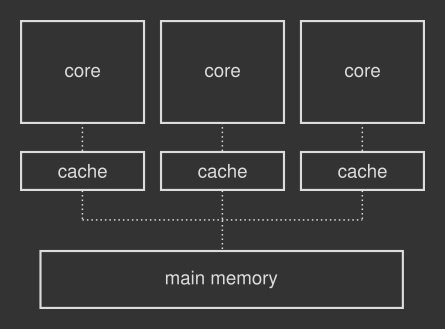

= Understanding memory reordering
George Cao <matrix3456@gmail.com>
:toc:
:sectnums:
:toc-title: 目录

...and why it matters when writing lock-free multithreading code.

理解内存重排序以及为什写无锁多线程代码时很重要。

.本系列中的其他文章
*  link:a-gentle-introduction-to-multithreading.adoc[多线程简介] - 一步一步走进并发的世界  
*  link:introduction-to-thread-synchronization.adoc[线程同步简介] - 多线程应用中最常见的的并发控制方法之一
*  link:lock-free-multithreading-with-atomic-operations.adoc[用原子操作实现无锁多线程] - 底层线程同步
*  link:understanding-memory-reordering.adoc[理解内存重排序] - 为什写无锁多线程代码时它很重要

In the previous article of this series, Lock-free multithreading with atomic operations, I introduced lock-free multithreading: a low-level strategy for synchronizing threads in concurrent software.

此系列前一篇文章中，link:lock-free-multithreading-with-atomic-operations.adoc[用原子操作实现无锁多线程] ，我介绍了无锁多线程：并发软件中线程同步的底层机制。

Based upon atomic operations — machine instructions performed directly by the CPU that can't be broken into smaller steps, lock-free multithreading provides a faster and more fine-tuned synchronization mechanism if compared to traditional primitives like mutexes and semaphores.

基于原子操作，也就是CPU直接执行不能细分为更小步骤的机器指令，相比传统的同步原语如互斥锁和信号量，无锁多线程提供了更快和能够更细粒度控制的同步机制。

As always, with great power comes great responsibility. In lock-free programming you get closer to the metal, so it is always a good idea to understand how the machine works and some of its quirks.

一如既往的，能力越大，责任越大。无锁编码中你更接近本质，因此理解机器是如何工作的以及机器的特性是个非常有益的。

In this article I want to show you one of the most important side effects that hardware (and software too) might cause on your lock-free code. This is also a great opportunity to marvel at the complexity of the miniaturized world inside your computer.

本文中我会介绍一些硬件（和软件）对无锁代码产生的非常重要的副作用。这也是惊叹计算机内部小型世界的复杂性的机会。

== Memory reordering, or the unpleasant surprise
== 内存重排序或者不愉快的惊喜

The first thing any programming course out there will teach you is how instructions written in the source code are executed sequentially by your computer. A program is just a list of operations laid down in a text file that the processor performs from top to bottom.

现有编程课程首先要教你的是计算机如何顺序执行用源代码写出的指令。一段程序就是文本文件中的一系列操作，处理器会从上到下执行这些操作。

Surprisingly, this is often a lie: your machine has the ability to change the order of some low-level operations according to its needs, especially when reading from and writing to memory. This weird modification, called memory reordering, occurs both hardware and software wise and it is mostly due to performance reasons.

意外的，这常常是一个谎言：你的机器有能力按需调整以下底层指令的执行顺序，尤其是内存的读取的时候。这个诡异的修改，叫做内存重排序，会发生在硬件和软件层面，且经常是因为性能的原因。

Memory reordering is a paradigm developed to make use of instruction cycles that would otherwise be wasted. This trick dramatically improves the speed of your programs; on the other hand it might wreak havoc over lock-free multithreading. We will see why in a minute.

内存重排序开发出来旨在利用那些原本要浪费掉的指令周期。这个技巧能大幅度提升你程序的执行速度；另一方面，它可能对无锁多线程造成严重破坏。我们马上能看到为啥。

Let's first take a closer look at the reasons why something this unpredictable would happen.
我们先来仔细看一下内存重排序这种不可预知的行为存在的原因。

== Memory reordering in a nutshell
== 内存重排序总结

Programs are loaded in the main memory in order to be executed. The CPU task is to run instructions stored there, along with reading and writing data when necessary.

程序想要执行，必须加载进主内存。CPU的任务就是执行存储在那的指令，同时在必要的时候读数据或者写数据。

Over time this type of memory has become damn slow if compared to the processor. For example, a modern CPU is capable of executing ten instructions per nanosecond, but will require many tens of nanoseconds to fetch some data from memory! Engineers don't like such waste of time, so they equip the CPU with a small yet extremely fast chunk of special memory called cache.

随着时间的推移，这种类型的内存和处理器比起来变得非常慢。例如，一个现代的CPU一个纳秒内能够执行10个指令，但是需要纳秒的许多倍时间从此内存中读取数据！工程师们不喜欢时间就这样浪费了，所以他们给CPU配上了容量很小但是速度非常考快的特殊内存，我们称之为缓存。

The cache is where the processor stores its most frequently used data, in order to avoid lethargic interactions with the main memory. When the processor needs to read from or write to main memory, it first checks whether a copy of that data is available in its own cache. If so, the processor reads from or writes to the cache directly instead of waiting for the slower main memory response.

缓存是处理为了避免和慢速主内存交互，用来存储CPU最常用的数据的。如果CPU需要从主内存读取或者写入主内存，它首先检测缓存看是不是有所需数据的副本。如果有，处理器就直接重缓存读取或者写入缓存而不会等待相比较慢的主内存的响应。

Modern CPUs are made of multiple cores — the component that performs actual computations, and each core has its own chunk of cache that is in turn connected to the main memory, as pictured in the following image:

现代CPU有多个核心组成的，核心（core）是真正执行计算的组件。每个核心拥有自己的独立缓存，如下图所示：

.多个核心通过缓存和主内存交互的简化模型。这也叫做共享内存系统，因为主内存被多个实体访问。

All in all, cache makes computers run faster. Or better, it helps the processor not to waste precious time waiting for the main memory response by keeping it always busy and productive.

总而言之，缓存能让计算机运行更快。更准确的说，缓存通过让处理器总是繁忙和高效来帮助处理器不要因为等待主内存响应而浪费宝贵的时间。

=== Memory reordering as an optimization trick
=== 内存重排序作为优化技巧

Clearly such caching mechanism increases the system complexity in a multi-core scenario. Now you will need detailed rules to determine how data flows across different caches, and to make sure each core has the most up-to-date version of it. Known as cache coherence protocols, they could potentially trigger huge performance penalties. So engineers conceived the memory reordering trick (and many others!) to get the best out of each core.

很明显缓存机制增加了多核场景下系统的复杂性。现在你需要详细的规则来决定数据如何在不同的缓存间流动，来保证每个核心有最新版本的数据，称之为缓存一致性协议，他可能触发非常大的性能下降。所以工程师们就设想用内存重排序来充分发挥每个核心的作用。

There are several reasons why a memory reordering might take place. For example, consider two cores instructed to access the same chunk of data in memory. Core A reads from memory, core B writes to it. A cache coherence protocol might force core A to wait while core B writes its local cached data back to the main memory, so that core A can read the most up-to-date information. The waiting core might choose to run other memory instructions in advance, instead of wasting precious cycles doing nothing. Even if such decision would depart from what you have explicitly written in your program.

内存重排序为什么会产生，比如，考虑2个核心同时访问同样的内存块。核心A从内从读取数据，核心B写入数据到内存。内存一致性协议可能会强制核心A等待核心B将本地修改的数据写回到主内存，这样核心A就能读到最新的数据。等待的核心可以选择提前执行其他内存指令，而不是浪费珍贵的的指令周期啥也不做。即使这个和你在程序中明确的代码顺序不一样。

Compilers and virtual machines too take the liberty of reordering instructions when certain optimizations are enabled. These changes happen at compile time and can be easily spotted by looking at the assembly code or byte code. Software memory reordering exists to take advantage of any feature the underlying hardware may offer, just to make your code run faster.

当特定的优化是开启了，编译器和虚拟机也会自用重排序指令。这些变化发生在编译时，可以通过汇编码或者字节码很容易的看到。软件内存重排序是充分利用底层硬件可能提供的特性来让你的代码运行的更快。

== A concrete example of hardware memory reordering
== 硬件内存重排序的具体样例

Consider the following example, written in hardware pseudo-code. Each step of the program corresponds to an individual processor instruction:

考虑下面用硬件伪代码写的样例。程序的每一个步骤都对应一个处理器指令：

[source,c]
----
x = 0
v = false

thread_one():
    while load(v) == false: 
        continue
    print(load(x))

thread_two():
    store(x, 1)
    store(v, true)
----
In the snippet above two threads are running in parallel on two different cores. The first thread waits until v is set to true by the other one. Let's also assume that store() and load() are atomic CPU instructions that write and read memory.

上面的代码片段中2个线程并发运行在2个不同的核心上。第1个线程等待第2个线程讲v设置未true。让我们假设 *store()* 和 *load()* 都是读取内存的原子的CPU指令。

What would you expect to see printed on screen by thread one? If it starts before thread two (and it is not always the case), there is no right answer. You might see 1 if no reordering takes place. However, it is possible for v to be updated before x, and the print statement might then print 0 if the store instructions are reordered in the second thread. Similarly, a memory reordering might take place in the first thread and it is possible for x to be loaded before v is checked.

你预计第1个线程在屏幕上打印出什么？如果他在线程2之前启动（并不总是这样的），就没有正确的答案了。如果没有重排序发生，你可能会看到1。尽管如此，如果第2个线程中的存储指令发生重排序，v的更新也可能发生在x之前，打印语句可能打印出0。相似的，内存重排序也可能发生在第1个线程中，也就是x的加载可能发生在v的检测之前。
 
== The impact of memory reordering on multithreading
== 内存重排序对多线程的影响

Hardware memory reordering is not an issue on single-core machines, where threads are a software construct ruled by the operating system. The CPU just receives a continuous stream of memory instructions. They still can be reordered, yet according to a fundamental rule: memory accesses by a given core will appear to that core to have occurred as written in your program. So memory reordering might take place, but only if it doesn't screw up the final outcome.

硬件内存重排序在单核计算机上没有问题，因为线程操作系统控制的软件是软件结构。CPU就是收到连续的内存指令流。指令还是可以被重新排序，不过要符合一个基本规则：给定内核的内存访问看上去就像和代码写的一样。所以，内存重排序可能会发生，但是只在不影响最终结果的前提下。

This rule still applies to each core in a multi-core scenario, but nothing takes care of the whole picture where different operations are simultaneously performed on separate hardware components (true parallelism). Make your threads run on two physical cores and you will experience any kind of weird surprise as seen in the example above. Not to mention the reordering performed by compilers and virtual machines!

这个规则也适用于多核场景下的每个单核，但不适用于不同操作同时跑在独立的硬件上的情况（真并行）。让你的线程跑在两个物理内核上，你就会碰到上面样例中的各种诡异问题，更不用说让编译器和虚拟机执行重排序了。

The usual locking synchronization mechanisms such as mutexes and semaphores are designed to take care of the memory reordering problem for you, both hardware and software wise. They are high level tools after all.

常规的如互斥锁和信号量等锁同步机制是设计用来处理硬件和软件层面的内存重排序的。毕竟他们是上层技术。

A multithreaded program that follows a lock-free approach is way closer to the metal instead: it exploits stores and loads atomic instructions to synchronize its threads, as seen in the previous episode. Funnily enough these are the operations that might get reordered, destroying all your careful plans.

不过，应用无锁方案的多线程程序更接近底层：就像上一篇文章看到的，它利用存储和加载原子指令来同步线程。 搞笑的是这些操作可能被重排序，从而破坏了你的严谨计划。

== How to solve the memory reordering problem
== 如何解决内存重排序的问题

You definitely don't want to build your synchronization mechanism upon something that might change randomly. This problem can be fixed in a practical way by triggering a memory barrier, a CPU instruction that forces the processor to execute memory operations in a predictable way. A memory barrier works like a barricade: operations issued prior to the barrier are guaranteed to be performed before operations issued after it.

你肯定不会基于一些随机变化的东西构建你的同步机制。这个问题可以通过引入内存屏障的方式来解决。内存屏障是强制处理器按照可预知的方式访问内存的CPU指令。内存屏障的工作方式类似路障：内存屏障之前的指令保证先于内存屏障之后的指令执行。

A memory barrier is a hardware thing: you have to talk directly to the CPU. This makes it a low-level solution which hurts the portability of your programs. The best way to tackle the problem is to step up the software hierarchy and make use of the tools that operating systems, compilers and virtual machines provide.

内存屏障是硬件层面的：你得直接和CPU交互。这是一个底层的解决方案，且不利用程序的可移植性。解决这个问题最好的方式是软件层次上走，利用操作系统，编译器或虚拟机提供的工具。

Software gadgets are only the halfway stage, though. Let's first take a high-level look at all the memory scenarios that might take place in a system, whether hardware or software, in order to build a clear mental map of the issue. The so-called memory model will help in the process.

尽管如此，软件工具也仅仅是中间阶段。为了构建一个此问题的清晰的全景图，我们首先全局看一下所有可能在硬件或者软件系统中的内存场景。所谓的内存模型在这个过程中发挥作用。

== The memory model
== 内存模型

A memory model is an abstract way to describe what a system may and may not do when it comes to accessing and reordering memory. Processors and programming languages implement one, especially if they make use of multithreading: a memory model applies both to hardware and software.

内存模型是抽象的方式描述系统中涉及到访问和重排序内存可能或者不可能发生的事情。处理器和编程语言会实现一个，尤其是利用多线程技术的时候：内存模型同时适用于硬件和软件层面。

When a system is very cautious about changing the order of memory operations is said to be following a strong memory model. Conversely, in a weak memory model you can expect all sorts of crazy reorderings. For example, processors in the x86 family belong to the former category, while ARM and PowerPC processors belong to the latter. What about software instead?

当系统对改变内存操作顺序非常谨慎，我们说系统遵循强内存模型。相反的，弱内存模型中你可能碰到各种各样的重排序。比如，x86系列的处理器属于前一类，而ARM和PowerPC处理器则属于后一类。软件层面又是怎么样的呢？

=== The benefits of a software memory model
=== 软件内存模型的好处

While hardware memory models are set in stone for obvious reasons, the software counterpart lets you choose how memory accesses can be ordered, according to your needs. This is an interesting property that will help a lot while writing lock-free multithreading code.

硬件内存模型存在的原因很明显，而对应的软件内存模型让你能够按需重排内存访问顺序。这个特性在你写无锁多线程代码的代码能帮很大的忙。

For example, a compiler can be instructed to produce machine code that follows a strong memory model, in order to avoid unwelcome reorderings around atomic operations used as synchronization mechanism. The compiler will do its best to provide the memory model you have requested by issuing the correct memory barriers, in case the underlying hardware implements a weak model. It also takes care of any memory reordering operation that might occur on the software side. Working with a software memory model abstracts away the hardware details.

例如，为了避免同步机制中不受欢迎的原子操作的重排序，编译器可以编译出遵循强内存模型的机器码。当底层硬件实现的是弱内存模型的时候，编译器会通过加入正确的内存屏障指令来最大限度的提供你需要的内存模型。编译器也负责软件层面的内存重排序指令。使用软件内存模型可以解耦硬件细节。

Basically all programming languages implement a memory model, in the sense that they follow specific rules for handling the memory internally. Some of them just stop there, as they don't deal with multithreading directly. Some others, Java, Rust and C++ to name a few, also provide tools to control the memory reordering behavior as described above.

基本上，所有的编程语言都会实现一种内存模型，某种意义上说，他们都遵循特定的规则来处理内存。一些编程语言也就到此为止了，因为他们不直接处理多线程。其他的比如Java，Rust和C++等也会提供上述的控制内存重排序行为的工具。
 
== Fine-tuning the memory model
== 细粒度内存模型

Strong vs. weak memory model is a theoretical classification of how memory operations get reordered. When it comes to actual coding, most programming languages that support atomic operations give you three ways to control memory reordering. Let's take a closer look.

强和弱内存模型是对内存操作如何重排序的理论上的分类。具体到真实的编码，大多数支持原子操作的编程语言会提供3种控制内存重排序的方式。我们仔细看一下。

=== 1) Sequential consistency

=== 1）顺序一致

The less intrusive way of memory reordering is no reordering at all. This is a form of strong memory model and is called sequential consistency: exactly what you need to solve all lock-free multithreading problems mentioned above. Disabling reordering makes your multithreaded program easy to follow: the source code is executed in the same order you have written it.

较少干扰的内存重排序方式就是根本不重排序。这是强内存模型的一种形式，称之为顺序一致：这正是解决上面提到的所有无锁多线程问题所需要的。禁用重排序能让你的多线程程序容易理解：源代码是按照书写顺序执行的。

Sequential consistency adds another important feature to parallel execution: if forces a total order of all atomic memory operations in all threads. To better understand this statement consider the following example, in hardware pseudocode:

顺序一致给并行代码执行加了另外一个重要特性：它强制了所有线程中的所有内存原子操作的整体顺序。为了更好理解这句话，考虑如下的硬件伪代码样例：

[source,c]
----
x = 0
y = 0

thread_A:
    store(x, 1)

thread_B: 
    store(y, 1)

thread_C:
    assert(load(x) == 1 && load(y) == 0)

thread_D:
    assert(load(x) == 0 && load(y) == 1)
----

Forget memory reordering inside specific threads for a second and just look at the big picture. If threads run, say, in order A - C - B - D, thread C sees x == 1 and y == 0 because it has been executed right in the middle between A and B, so its assertion won't fail. Here's the catch: the total order imposed by sequential consistency forces thread D to see the same events as thread C, so its assert will fail. It's impossible for thread D to see the two stores ordered in a different way than what thread C has perceived. In other words, with sequential consistency all threads will see the same story line.

我们暂时不考虑单个线程内的内存重排序，看一下全局情况。如果线程按照A-C-B-D的顺序运行，线程C能看到 x == 1 和 y == 0，这是因为线程C是在线程A和线程B之间运行的，因此线程C的断言不会失败。但是这也是问题所在：顺序一致强加的全局顺序迫使线程D看到与线程C一样的事件，因此线程D的断言会失败。线程D不可能看到和线程C不一样的存储顺序。换句话说，线性一致下，所有的线程都看到同样的东西。

As I said before this is a very intuitive and natural way of thinking about multithreaded execution. However, sequential consistency disables any potential hardware or software optimization a memory reorder could offer: a recipe for serious performance bottlenecks. Sequential consistency is a necessary evil sometimes, for example in multiple producer-multiple consumer situations where all consumers must observe the actions of all producers occurring in the same order.

就像前面说过的，这是一个非常直观和自然的思考多线程执行的方式。尽管如此，顺序一致也取消了内存重排序带来的任何硬件或者软件优化：这通常会引起严重性能瓶颈。顺序一致有些时候是必要的，比如多生产者-多消费者情况下消费者必须按照生产者的生产顺序消费。

=== 2) Acquire-release ordering

=== 2）获取-释放顺序

Acquire-release is halfway between a strong and a weak memory model. First of all, acquire-release works like sequential consistency except that you don't have a total order of execution. Let's go back to the previous example for a moment: with acquire-release, thread D is allowed to see a different story line than thread C, so that its assert too may pass.

获取-释放是强和弱内存模型的中间状态。首先，获取-释放和顺序一致工作方式相似，除了没有全局执行顺序。我们在看一下上面的那个例子：在获取-释放情况下，线程D是允许看到不同于线程C的事件，因此线程D的断言有可能会通过。

The absence of a total order is just a side effect here. Acquire-release provides synchronization around a specific shared atomic variable across multiple threads. That is, you can for example synchronize thread A and thread C around the shared variable x so that thread C loads the value only when thread A has finished writing. In this case y is not taken into account, so you can expect any kind of reordering around it.

全局顺序的缺失其实是个副作用。获取-释放是针对特定共享原子变量在多个线程之间同步的。也就是说，你在线程A和线程C之间同步共享变量 x，使得线程C只能在线程A完成写入之后才读取。这种情况下，y 并没有考虑进去，所以你可碰到任何针对它的重排序。

Concretely, programming languages that support this ordering allow you to tag memory accesses as acquire or release. An atomic store marked as release on a shared variable in thread A guarantees that thread B will see the full and not reordered sequence of memory events performed by thread A, once thread B triggers an atomic load marked as acquire on the same variable. I know it's brain-melting, but this is the foundation that mutexes stand on: critical sections and their protected area are built with this stuff (acquire-release name comes from the mutex jargon, where you acquire and release locks on it).

具体来说，支持这种有序性的编程语言允许你将内存访问标记为获取或者释放。当线程B触发某共享变量上标记为获取的原子加载操作，线程A中的同一个共享变量上标记为释放的原子存储可确保线程B将看到线程A执行的完整且不是重新排序的内存事件序列。我知道这比较烧脑，不过这是互斥锁的基础：关键区和它保护的区域就是用这个构建的（获取-释放名字来源于互斥锁术语，也就是获取和释放互斥锁）。

Acquire-release allows for more optimization opportunities as only some memory reorderings are prevented. On the other hand your code becomes more difficult to reason about.

获取-释放允许更多的优化机会，因为仅有部分内存重排序不被允许。换句话说，你的程序更不容易推理分析了。

=== 3) Relaxed ordering
=== 3）松散顺序

This is a form of weak memory model. With relaxed ordering you are telling your program that you don't care about memory reordering at all. The compiler and the processor are free to do whathever they want in order to optimize the execution. What remains is of course the atomic nature of the memory operation: this is useful for example for incrementing shared counters, where you just want the operation to be atomic so that other threads don't see the operation half complete.

还有一种弱内存模型的形式。松散顺序的情况下，你写程序的的时候根本不关心内存重排序。编译器和处理器可以尽可能的优化程序执行。当然了内存操作的原子特性是保留下来了：这在增加共享计数器的时候非常有用，这种情况下操作必须是原子的才能让其他线程不能看到未完成的中间状态。

Relaxed ordering doesn't guarantee a specific memory ordering, so it's not a tool you can safely use for thread synchronization. On the other hand, allowing any kind of memory tricks increases the performance of your multithreaded application.

松散有序性不保证任何特定的内存重排序，所以这不是可以安全使用的线程同步工具。另一方面，这也允许使用任何内存技巧来提升你的多线程程序的性能。

== What's next?
== 下一步？

In this article I wanted to take a bird's eye view on the memory reordering problem, the reasons behind its existence and its impact on lock-free multithreading. In the next episode I'll get my hands dirty by playing with some C++ code that makes use of atomic operations.

这篇文章中，我想对内存重排序问题以及其存在的原因和它对无所多线程的影响有一个全面的了解。接下来我会写一些使用原子操作的C++代码来实践一下。

Why C++? The language has recently introduced a very detailed memory model, which allows you to fine-tune how memory operations can be ordered around the C++ atomic objects. I believe it's a good way to see how sequential consistency, acquire-release and relaxed ordering play together in some real world scenarios. Wish me good luck :)

为什么是C++？因为C++语言近期引入了非常详细的内存模型，使得你能够细粒度的控制C++原子对象的内存重排序操作。我相信这是一个很好的方式去看顺序一致，获取-释放和松散有序在真实的场景下是如何一起工作的。祝我好运吧:)。

== Sources
== 参考

AA.VV. - A Primer on Memory Consistency and Cache Coherence
AA. VV. - C++ Reactive Programming Paul E. McKenney - Memory Barriers: a Hardware View for Software Hackers
cppreference.com - std::memory_order
GCC Wiki - Memory model synchronization modes
doc.rust-lang.org - Atomics
Herb Sutter - Atomic Weapons 1 of 2
The ryg blog - Cache coherency primer
The ryg blog - Atomic operations and contention
Bartosz Milewski - C++ atomics and memory ordering
Bartosz Milewski - Who ordered sequential consistency?
StackOverflow - Memory barriers force cache coherency?
StackOverflow - How does the cache coherency protocol enforce atomicity?
StackOverflow - Does a memory barrier ensure that the cache coherence has been completed?
StackOverflow - C++11 introduced a standardized memory model. What does it mean? And how is it going to affect C++ programming?
StackOverflow - How do memory_order_seq_cst and memory_order_acq_rel differ?
StackOverflow - What do each memory_order mean?
Just Software Solutions - Memory Models and Synchronization
Wikipedia - CPU cache
Wikipedia - Cache coherence
Wikipedia - Memory barrier
Wikipedia - Memory ordering
James Bornholt - Memory Consistency Models: A Tutorial
Preshing on Programming - Memory Ordering at Compile Time
Preshing on Programming - Memory Barriers Are Like Source Control Operations
Linux Journal - Memory Ordering in Modern Microprocessors, Part I
Doug Lea - Using JDK 9 Memory Order Modes

本文译自https://www.internalpointers.com/post/understanding-memory-ordering，英文读者可直接阅读原文。