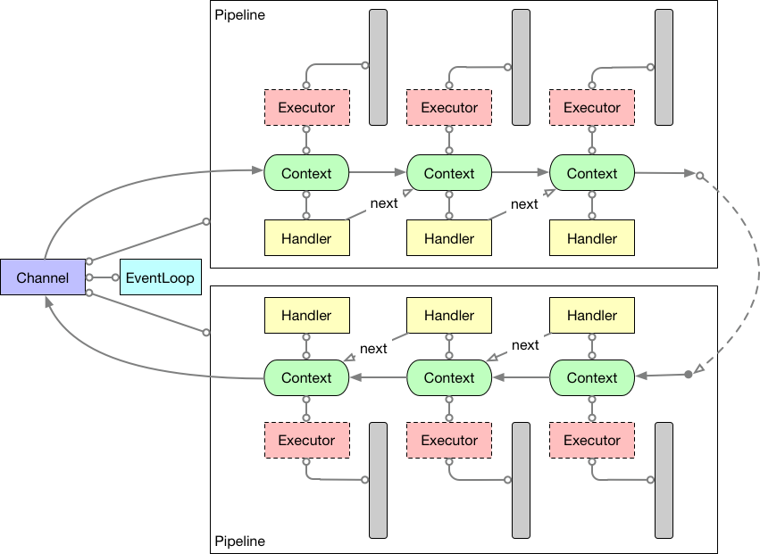

= Netty 4 线程模型
乔治 <matrix3456@gmail.com>
2021-05-12
:jbake-type: post
:jbake-status: published
:jbake-tags: netty,多线程,线程模型
:idprefix:

Netty 4 的线程模型核心是一个连接(channel)一个线程(thread)，但是一个线程可以绑定到多个不同的连接。也就是每一个连接上的所有I/O事件都是一个线程(EventLoop)来执行的，这个线程也可以叫I/O线程。这样从连接的角度看就是一个连接一个线程的单线程模型，省去了多线程同步的代价，写起代码简单可靠；从线程的角度看一个线程可以管理多个连接，工作起来也不需要大量的线程。当遇到业务逻辑比较耗时的情况，Netty允许这部分工作交给单独的线程池(EventExecutor)执行，执行完成产生的事件在通过提交到连接绑定的线程工作队列中，回到I/O线程中来继续流转。

== Netty线程池

简单朴素的正向思路，线程池就是提前实例化多个线程，有任务的时候呢，先挑一个线程出来，然后把任务给它执行。有过数据库连接池使用经验的话，应该很熟悉这种模式。

[source,java]
----
int size = 100;
Thread[size] = new Thread[size]; //线程池
----
注：这里面的size如何决定，请参见 link:./../05/how-to-size-thread-pool.adoc[如何设置线程池的大小]。

不过Doug Lea大神在Java 1.5提供的线程池实现则不是这么简单粗暴，而是通过Executor抽象把线程池这部分透明化了，变成了提交一个异步任务，得到一个代表执行结果的Future对象。 这样就不需要处理线程同步、等待等问题了。

理解Java的线程池实现对理解Netty的线程模式非常有帮助，因为Netty里面是自己定制实现了一个Executor。

=== 实现思路

Netty中的Executor实现有2中，一个是EventLoop，一个是EventExecutor。EventExecutor更像是Java中的Executor，用来多线程执行业务代码，而EventLoop是EventExecutor的特殊实现，它是绑定到Channel上的。

EventLoop和channel之间的关系是一个channel只能注册到一个EventLoop，而一个EventLoop可以绑定到多个Channel。 每个EventExecutor都会绑定唯一的一个线程，并且可以有0或者1个工作队列（EventLoop）。提交任务的时候将任务放去工作队列，而绑定的线程则不停地轮询（Loop）工作队列，如果有任务则执行，没有就等待，直到Executor关闭才退出循环。EventExecutor和JDK中的线程池Executor非常类似的思想。

=== 延迟绑定

EventExecutor 第一次执行任务的时候，使用ThreadPerTaskExecutor创建一个新线程，并且绑定到这个EventExecutor。ThreadPerTaskExecutor非常特殊，没有工作队列，每个任务都是新创建一个线程去执行，顾名思义。而当前任务呢将作为这个线程的第一个任务去执行。一般来讲绑定任务都是个无限循环，不停地从当前的Executor的任务队列中拉取任务执行，直到停止或者关闭的时候才结束。

== Netty事件模型

Netty 4中的核心事件处理流程是下图这样的：

.Thread任务执行模型

从一个Channel建立开始，绑定一个EventLoop，通过一个由Handler顺序组成的Pipeline完成一次事件处理并返回结果（如果有必要的话）。

=== 多线程环境

使用Netty的一个最佳实践就是不要阻塞I/O线程。那么应用自己的一部分比较耗时的逻辑该如何不阻塞I/O线程呢？

Netty是通过Pipeline中的每个Handler可以显式绑定一个Executor的方式来实现业务多线程执行，从而不阻塞I/O线程。如果没有绑定的话，就使用Channel默认绑定的EventLoop执行。每个Handler执行任何Read或者Write操作都会检查当前Executor和绑定的是否一致，如果一致的话，单线程直接执行任务；不一致，当前Executor将把操作封装成一个任务提交到下一个Executor的任务队列中。整体流程参考上图。

Netty中默认都是使用的I/O线程，也就是Worker线程去执行任务，如果你的Handler里面有耗时任务，比如常见的网络操作，在加上一个EventLoop可以绑定到多个Channel，那么强烈建议给这个Handler显式绑定一个EventExecutorGroup，使得I/O线程能够继续处理I/O操作。如果阻塞当前线程的话，1个或者多个Channel将被阻塞，从而严重影响吞吐量。

EventExecutor上创建的Promise或者Future，当前线程是用来阻塞等待的（wait/notify机制），实现的效果就是谁调用阻塞方法，就阻塞谁。但是当Promise和Future完成（notify）之后，是用这个EventExecutor去通知所有的监听者。

EventExecutor可以看做一个普通的线程，去执行业务任务。EventLoop作为EventExecutor的特例，只用来执行I/O相关任务，因此也不能被阻塞。

=== 一些的注意点

1. NIO模式下，Netty中Channel和JVM的Channel是通过附件attachment关联起来的。

2. ByteBuf要在同一个线程里面创建和回收，从而避免内存泄露。因为ByteBuf Pool用的是ThreadLocal实现的。

== 参考

* New and noteworthy in 4.0 - http://netty.io/wiki/new-and-noteworthy-in-4.0.html
* Upgrading a Reverse Proxy from Netty 3 to 4 - https://medium.com/square-corner-blog/upgrading-a-reverse-proxy-from-netty-3-to-4-878ec407665a#.yyrawts8y
* EventLoop -> EventExecutor Lazy Bind - http://www.infoq.com/cn/articles/netty-version-upgrade-history-thread-part
