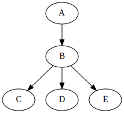
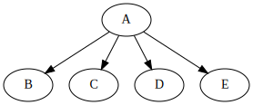
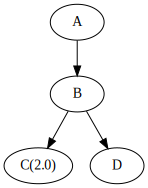
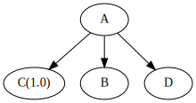
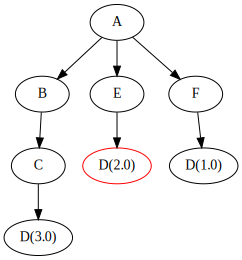
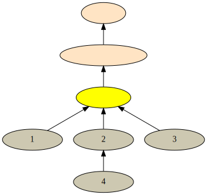

= Maven依赖管理理解
乔治 <matrix3456@gmail.com>
2021-09-24
:icons: font
:jbake-type: post
:jbake-status: published
:jbake-tags: maven,dependency,bom
:idprefix:
:graphvizdot: /usr/local/bin/dot

根据[.underline]##https://www.jrebel.com/resources/java-developer-productivity-report-2021[JRebel 2021 Java Developer Productivity Report]## ，Java项目构建工具中第一名的Maven占了67%，第二名的Gradle是20%。所以理解和掌握Maven是非常必要的。

现在稍微大一点的Java项目都会涉及到bom和module，然后经过在pom.xml中的parent和dependency节点的组合之后，很方便的管理了。 不过也很容易造成模块或者依赖类库版本的冲突。而且这种问题一般编译期间不容易发现，到了运行期间就会出这种依赖的问题。遇到依赖的类库不符合预期的时候，我们一般就会问2个问题：

- 怎么引入的这个类库？
- 为什么选择了这个版本？

为了回答这两个问题，我们先从介绍Maven开始。

== BOM

BOM(Bill Of Materials)实质上就是一个特别的POM，在这个POM中集中的定义项目的依赖和管理和更新他们版本。这个就把管理和更新依赖及其版本的职责集中到一处统一管理、测试以及发布，其他项目只要依赖这个POM就省去了每个人都要考虑使用那个依赖的那个版本的问题。

BOM一般有两种使用方式，

- 一种是直接通过pom.xml中的parent节点继承，一个项目只能有一个parent，这种常见的是一个组织内部自定义的BOM。

[source,xml]
----
<parent>
    <groupId>org.springframework.boot</groupId>
    <artifactId>spring-boot-dependencies</artifactId>
    <version>2.5.4</version>
    <relativePath/>
</parent>
----

- 另一种方式是在pom.xml中的dependency management中使用import pom的方式引入。 这个没有数量的限制，常见的第三方类库都可以通过这种方式管理。

[source,xml]
----
<dependencyManagement>
    <dependency>
        <groupId>org.springframework.boot</groupId>
        <artifactId>spring-boot-dependencies</artifactId>
        <version>2.5.4</version>
        <type>pom</type> // <1>
        <scope>import</scope> // <2>
    </dependency>
</dependencyManagement>
----

<1> type指定为pom
<2> scope指定为import

== 继承(Parent)

pom.xml中声明parent节点之后，就是当前项目pom会继承指定的parent节点中的项目。 所谓的继承，也没啥特别的，其实就是一个把父项目中内容拷贝合并到子项目中的意思。只不过在拷贝合并的过程中，子项目中的元素会覆盖(overwrite)父项目中的相同元素。 而且一个项目只能有一个parent项目，这是不是和Java语言中的类的单继承机制很像？

所以maven编译的时候就是直接递归的把当前项目的所有父项目的pom.xml内容依次拷贝到子项目的pom.xml文件中，同时在这个拷贝合并的过程中应用上面的覆盖原则。 之后就生成了一个effective pom，效果相当于执行如下命令：

[source,shell script]
----
mvn help:effective-pom
----

事实上，Maven还允许精细化控制这个拷贝合并的继承机制，更多细节参见Maven**https://maven.apache.org/pom.html#Plugins[POM Reference]**

== 传递依赖(Transitive Dependencies)

传递依赖是说当前项目能够自动的把它依赖的类库的依赖引入过来。这样就省去了当前项目重复的逐个申明依赖的类库。

假设有A项目申明了依赖B，而项目B申明了依赖C，D和E：

.A只申明了依赖B

应用依赖传递之后，项目A实际上是依赖的B，C，D和E。效果等同下图：

.A实际上依赖了B，C，D，E

这里面还涉及一个依赖的scope的问题，会影响依赖的传递，先不细说了，也不影响理解依赖的传递。

== 依赖管理(Dependency Management)

BOM中dependencyManagement元素就是集中定义依赖及其版本的地方，这样使用这个BOM的项目就不需要在单独定义版本了。而且dependencyManagement元素中的依赖只有用到了才起作用，也就是出现在dependencies节点中的时候，这时候就不用指定依赖的版本号了。

[quote,Maven,https://maven.apache.org/guides/introduction/introduction-to-dependency-mechanism.html]
Dependency management - this allows project authors to directly specify the versions of artifacts to be used when they are encountered in transitive dependencies or in dependencies where no version has been specified.
In the example in the preceding section a dependency was directly added to A even though it is not directly used by A. Instead, A can include D as a dependency in its dependencyManagement section and directly control which version of D is used when, or if, it is ever referenced.

dependencyManagement元素中定义的依赖及其版本是能够直接控制传递依赖和没有指定版本的依赖的版本的。但是如果是当前项目的pom.xml的dependencies节点中直接申明的带版本的依赖，则不受dependencyManagement中定义的版本控制。

假如项目A中直接依赖了B，通过B间接依赖的2.0版本的C，如下图：

.A项目的传递依赖C(2.0)

这时候如果 dependencyManagement元素中直接定义了1.0版本的依赖C，那最终A项目依赖的C是1.0版本的：

.A项目的实际依赖C(1.0)

== 依赖协调(Dependency Mediation)

我们知道一个依赖可以通一个三元组(groupId:artifactId:version)来确定, 其中的groupId:artifactId组合用来区分不同的依赖，同一个依赖则是用version来确定用哪一个。

这里面的version没有具体的规范，就是一个字符串, 所以Maven不知道同一个依赖的不同版本哪个是新的，那个是旧的。因此有多个版本的时候不是选用最新的版本，而是选当前项目的依赖中最近的声明版本(nearest definition)。

[quote,Maven,https://maven.apache.org/guides/introduction/introduction-to-dependency-mechanism.html]
Dependency mediation - this determines what version of an artifact will be chosen when multiple versions are encountered as dependencies.
Maven picks the "nearest definition".
That is, it uses the version of the closest dependency to your project in the tree of dependencies.
You can always guarantee a version by declaring it explicitly in your project's POM.
Note that if two dependency versions are at the same depth in the dependency tree, the first declaration wins.

把当前项目的依赖组织成一棵树, 姑且称之为依赖树，寻找最近申明的依赖的过程就是广度优先(BFS)遍历这棵树，遇到遍历过的依赖就剪枝，删除包含遍历过的节点以及其子树。这样就是在依赖树中寻找到当前项目的最短路径的依赖，而相同层级的话，也优先使用了最先遇到的。这里面也隐含了依赖申明顺序的问题，稍后说明。

假设项目A的依赖关系如下图，对于D这个依赖来讲，应用nearest definition原则，Maven最终会选用的版本是D(2.0)。

.项目A的依赖树

== 依赖优先级

整个依赖管理中的优先级从高到低依次如下：

. 项目的dependencies中直接声明的依赖及其版本，一般同一个项目中不会申明相同依赖的不同版本，如果出现的话，优先使用先申明的依赖；
. parent项目的dependencies节点中申明的依赖及其版本(参考上面的继承)；
. import pom中申明的依赖及其版本，import pom的顺序很关键，如有依赖有版本冲突，按照声明的顺序依次使用；
. 当前项目的间接传递依赖及其版本。

总结下来就是不同优先级的按照从高到低的优先级，相同优先级的按照他们的申明顺序从上到下(pom.xml文件解析顺序，也就是依赖申明顺序)。

按照这个优先级，如果你发现有依赖的版本不符合预期，则可以通过这个优先级顺序在合适的地方直接申明想要的依赖就可以了。常见的我们就会直接在当前项目的pom.xml中直接申明一下需要使用的版本就可以了。

这个优先级以及顺序，也是构建依赖树的优先级和顺序。

== 常用排查命令

=== 查看依赖树

查看依赖树是非常常用的，这里除了默认的文本输出，还可以使用outputType参数来指定格式如graphml,dot等，接着就可以可视化的展示依赖树了。

[source,shell script]
----
mvn dependency:tree -DoutputType=graphml -DoutputFile=dependency.graphml
----

=== 查看依赖使用情况

分析依赖使用与否的情况，貌似不太准确，参考就可以了。

[source,shell script]
----
mvn dependency:analyze
----

== 结论

整个Maven依赖管理以当前项目为中心分为2部分，当前项目以上部分适用继承合并pom.xml，当前项目以下的依赖部分适用传递依赖与最短申明距离的依赖协调机制。

.Maven项目树

通过以上分析，就能回答前面提出的2个问题，并且解决版本冲突的问题。

== 参考

* JRebel 2021 Java Developer Productivity Report, https://www.jrebel.com/resources/java-developer-productivity-report-2021
* Introduction to the Dependency Mechanism, https://maven.apache.org/guides/introduction/introduction-to-dependency-mechanism.html
* Spring with Maven BOM, https://www.baeldung.com/spring-maven-bom
