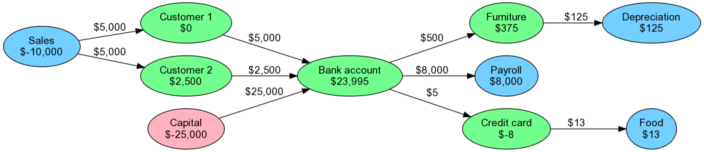

= 复式记账
乔治 <matrix3456@gmail.com>
2022-03-19
:icons: font
:jbake-type: post
:jbake-status: published
:jbake-tags: 会计,记账,复式记账,beancount,有向图
:idprefix:

个人一直有一个记账的诉求，直到遇到beancount，才发现个人财务和这几年再创业公司了解的财务有许多相通之处，也是在使用beancount的时候才发现之前在公司了解的财务知识不够扎实，因此重新梳理一下复式记账的知识。

== 复式记账

记账之前先了解一下交易。 经济里面说的一个人的支出是另一个人的收入，反之亦然。这是通过两两之间"等价交换"的方式来实现的，这就是交易。一笔交易会涉及2个主体，以及主体之间以交易额衡量的经济资源的转移。多方交易最终也是由两两之间交易构成的。记账最基本的就是记录清楚每笔交易。

=== 单式记账

单式记账是以账户拥有者的**账户**视角，记录账户余额随着交易的发生而产生的变化。 这里面只涉及一个账户，比如说你信用卡账单，就是信用卡这一个账户的**流水账**。如果你有多个银行卡，每个银行卡的账单之间是没有关系的。如果说有关系，那也是通过备注等描述信息标注出来的。

=== 复式记账

复式记账则是交易的双方都需要记录本次交易，一笔交易在交易两方分别记了一次，以交易额的转移方向为箭头，流出就从出账户的余额减去交易额，流入就将入账户的余额增加交易额。复式记账的解释以DDIA的作者Martin Kleppmann写的这篇博文中[.underline]##https://martin.kleppmann.com/2011/03/07/accounting-for-computer-scientists.html[Accounting for Computer Scientists]##用计算机人知道的图论中有向图的方式最容易理解了：

.账户与交易

我个人认为这也是复式（double-entry）的意思。在这个有向图中，所有的节点都是账户，节点内的数字是账户余额；节点之间的边都是交易，每条边上标注的数字就是交易额，边的剪头表示经济资源的流向。

当我们一穷二白啥也没有的时候开始参与经济生活的时候，我们所有的账户余额都是0，所以余额之和也为0。随着交易的进行，比如领了工资，买了房子之类的交易的产生，各个账户的余额随着发生变化，但是所有账户的余额之和任然为0。这就是复式记账的妙处，也就是**会计恒等式**始终成立的意思。如果所有账户预额为0不好理解的话，接着往下看。

== 会计恒等式

我们先从财务会计书本上的会计恒等式开始：

资产（Assets） - 负债（Liabilities） = 权益（Equity）

[source,text]
----
Assets - Liabilities = Equity //<1>
----

权益可以经一步细分为：初始资本（Capital）、收入（Income）和支出（Expenses）三部分。关系如下：

[source,text]
----
Equity = Capital + Income − Expenses //<2>
----

整合一下上面两个公式，我们得到了：

[source,text]
----
Assets - Liabilities = Capital + Income - Expenses //<3>
----

在这个公式里面，我们还是用Equity来表示初始资本（Capital），则公式最终为：

[source#eq4,text]
----
Assets - Liabilities = Equity + Income - Expenses //<4>
----

到这一步的时候，上面4个公式都很直观，符合会计知识的，也比较符合现实情况。从记账的角度，公式4可以包含企业（包括）的所有的重要信息。所以这也是会计中账户的5个类型，不多也不少，交易账户必然属于其一。

=== 账户类型

我们以钱为例子，先理解一下账户类型：

- 资产（Assets）: 记录你当前所能支配的钱，或者通过交易可以变为钱东西。常见的比如各种银行的存款账户、兜里的现金、车子、房产等等。别人欠你的钱（应收账款）和你欠别人的钱（负债，因为钱在你这，你可以支配）都是你的资产。
- 负债（Liabilities）: 你欠别人的钱。别人的钱现在是在你的兜里，在没有还回去之前，你可以自己决定怎么花，所以也是你的资产。
- 支出（Expenses）: 你花出去的钱，而且是花出去之后不会在回来了。常见的如花钱买商品，买服务等。你不退款的前提下，这部分钱就是别人的了。
- 收入（Income）: 你得到的钱，得到之后不用还回去的。比如常见的你劳动所得的工资，你投资的收益，股票的分红，公司出售商品/服务后客户支付的钱等。
- 权益（Equity）: 根据会计恒等式，权益本来是资产净值，细分之后理解为资产净值的初始值，也就是记账周期开始时的资产净值，对企业来说就是企业所有者的资金。

值得注意的是上面公式中的数值都是**正数**。既然都是正数，那么资产、负债、收入、支出或者权益的增减怎么表达呢？会计上使用**借记**和**贷记**。

=== 借记和贷记

**借记**和**贷记**在现在的会计概念中的具体含义以及理解方式参考xref:basic-accounting-concepts-2-debits-and-credits.adoc[基本会计概念2-借记与贷记]中的介绍。总结一下就是**借记**和**贷记**是会计特有的分类系统，用他记录交易中经济资源从来源（**贷记**）到目的地（**借记**）的流动情况，它还确保在输入每笔交易后会计等式保持平衡。

『借记』和『贷记』只是用来标记经济资源的流向的，不代表借记一定是增加，贷记一定是减少。整个记账过程中先确定流向，接着确定交易额，再根据流向和每个账户的类型确定是将余额增加还是从余额中减少相应的交易额。这个事情做多了，就能总结出老会计牢记在心的口诀：就是什么账户类型，什么具体流向的账户余额是增加还是减少。这是大部分外行不明就里，产生困扰的地方。

在确定流向的过程中有4个重要的原则：

. 会计中记账都是从企业自身的角度记的。比如信用卡账单从持卡人的角度和从银行的角度来讲，交易记录中经济资源的流向是完全不同的。
. 企业和企业所有者是两个独立的实体，他们之间也可以产生『交易』，比如所有者权益（Equity）
. 记账人应该是一个企业运营者从企业的角度思考交易的
. 会计系统是一个封闭的系统，也就是所有的交易都必须纳入其中，并只在此系统中流动（内循环 xD）

那来源（贷记）和目的（借记）怎么确定呢？，配合着以上4个规则，问下面3个问题：

- 现实世界中交易涉及的经济资源的来源和目的是什么？
- 在封闭的会计系统中的分别代表他们的账户是什么？
- 账户分别属于什么类型？

比如个人记账的过程中，领工资这个事情：

- 工资涉及的钱的**来源**是雇主公司，钱的**目的（去向）**是我的钱；
- 『雇主公司』在复式记账系统中的代表是收入（Income）：记为贷，『我的钱』在记账系统中的代表是资产（Assets）：记为借；
- 来源是收入（Income）-贷记，余额增加；去向是资产（Assets）-借记，余额增加

用借记和贷记来描述会计恒等式，就是**贷记总金额等于借记总金额**。 现在你大概可以和公司的老会计正常交流了。

对<<eq4,公式4>>稍微做一下数学中等价变换，得到了下面这个公式5：

[source#eq5,text]
----
Assets + （-Liabilities） + （-Equity） + （-Income） + Expenses = 0 //<5>
----

令：

[source,text]
----
Liabilities = -Liabilities;
Equity = -Equity，
Income = -Income
----

，然后替换<<eq5,公式5>>得到公式6：

[source#eq6,text]
----
Assets + Liabilities + Equity + Income + Expenses = 0 //<6>
----

这个和前面<<复式记账>>中用有向图的方式得出的结论是一样的：所有账户余额之和为0。对应到有向图中，就是负债（Liabilities），权益（Equity），收入（Income）这3种类型的账户余额是**负数**，而资产（Asserts）和支出（Expenses）这2种类型的账户余额是**正数**。这样就能统一为流出（来源）就从出账户的余额减去交易额，流入（目的）就将入账户的余额增加交易额。不用使用『借记』和『贷记』，非常好记账。这也是beancount再用的记账方式。后面再介绍beancount的使用。

我们能也能看出，余额为负只是一种数据计算上的便利，真正有意义的数字是他的绝对值。只要习惯就好。

== 报表

每笔交易记录清楚之后，就能产生会计中最重要的2张报表：资产负债表和损益表。 这完全就是不通的账户类型进入不通的报表。

=== 账户分类与报表

==== 余额与差额

账户之间最明显的一个区别是：我们到底想知道一个账户的余额，还是它的差额。比方说对于支付宝余额、信用卡欠款，我们更在意现在钱包还有多少钱，因此余额比起差额来说应该更加重要。而对于餐厅账户来说，比起了解这辈子到底花了多少钱吃饭，这个月到底花了多少才更具指导意义，因此对它来说差额又更加重要。

|===
|B/D|正数|负数|报表
|更关注**余额**|资产（Assets）|负债（Liabilities）|资产负债表
|更关注**差额**|支出（Expenses）|收入（Income）|损益表
|===

=== 位置与目的

账户还可以区分钱在哪（Location）和钱用来干什么了（Purpose）。

|===
|L/P 2+^|账号类型 |报表
|位置（Location）|资产|负债|资产负债表
|目的（Purpose）|收入|支出|损益表
|===

== 结论

我们从常规的流水账开始，扩展到复式记账，然后用大神总结出来的有向图的方式理解复式记账的一般形式，这对计算机相关专业的人来说比较直观。然后也尝试着把它和会计知识联系在一次，从而应用到日常生活和工作中，最后得到了最重要的两张报表：资产负债表和损益表，也间接的了解到账户和报表之间的关系。至于beancount的具体使用部分，后面再单独介绍。

== 参考

* Peter Selinger, Tutorial on multiple currency accounting, https://www.mathstat.dal.ca/~selinger/accounting/tutorial.html
* Martin Blais, The Double-Entry Counting Method, https://beancount.github.io/docs/the_double_entry_counting_method.html
* 复式记账指北（一）：What and Why？ , https://blog.kaaass.net/archives/1659
* Martin Kleppmann, Accounting for Computer Scientists, https://martin.kleppmann.com/2011/03/07/accounting-for-computer-scientists.html
* xref:basic-accounting-concepts-2-debits-and-credits.adoc[基本会计概念2-借记与贷记]
