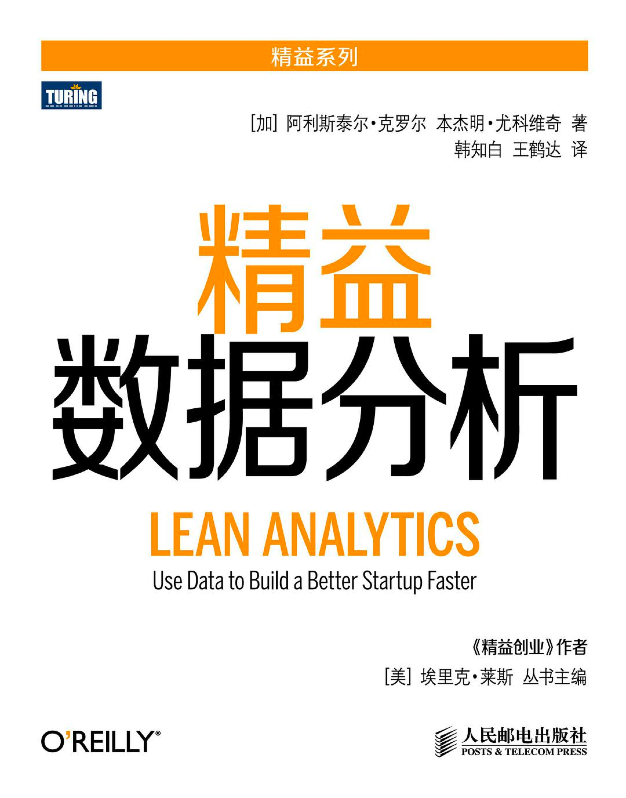

= 商业核心窥探
乔治 <matrix3456@gmail.com>
2022-04-11
:icons: font
:jbake-type: post
:jbake-status: published
:jbake-tags: 公司,经营,商业,效率,数据分析
:idprefix:

创业公司的经营视角看业务，经常会遇到很多商业术语，这对理解商业模式非常有帮助。同时跟不同角色的人打交道，更需要理解术语，还需要理解术语之间的关系，才能顺畅的交流。术语本身是就像**世上本没有路，走的人多了也就成了路**一样，是随着特定行业领域发展而总结出来的有一定概括性的描述或概念，用来高效表达与交流的。

== 业务核心

基本上，任何生意的最核心部分就是三个公式：

[source#eq1,text]
----
订单数 * 客单价 = 总收入 //<1>
----

[source,text]
----
变动成本 + 固定成本 = 总成本 //<2>
----

[source,text]
----
总收入 - 总成本 = 总利润 //<3>
----

这里面有些生意是**直接的**，比如你开一个小卖铺卖煎饼，算账就这么直接算就好了；而有些是**间接的**，比如互联网业务是**羊毛出在猪身上**，主营业务和盈利方式不是那么的直接看出来。像给用户出租车辆的租车公司挣的是保险的钱，而不是租金，而持车公司则是挣两三年之后卖二手车的残值。但是不管怎么样，公司最后都要回到上面3个公式来挣钱。这就要需要先通过**单位经济效益**来确定订单之后在分析。

== 单位经济效益

[quote,曲凯,《创投42章经》]
单位经济效益是，在商业模型中，能够体现收入与成本关系的某个最小运作单元。（公司的整体交易数据都是由所有的单笔交易叠加在一起得来的，所以只研究透单笔交易的逻辑可以排除很多不必要的干扰，更容易看出商业模式的本质，并且找出其中最需要关注的问题点。）想要分析单位经济效益，第一个任务就是判断和选定某个商业模式中的“最小运作单元”。这个单元一般就是产品或服务收费的最小单元，比如“一件快件”、“一盒化妆品”、“一公里车费”、“一小时美甲”等。这个最小单元的选择并不一定是唯一的，但核心宗旨就是选出那个最能体现收入和成本变化联系的最小的单元。当单元选定之后，就是判断围绕这个单元的收入和成本构成了。

这个最小单元就是核心公式中的订单的选择了。

== 商业术语

客单价:: 客人每笔订单均价。还有一种说法就是一个客人每次消费的价格，这时有可能一次消费包含了多笔订单，而将这部分订单总额理解为客单价。比如去一次中免免税城，在不同的柜台买了不同的东西，肯定是多笔订单，但是中免对外说客单价是大几千上万元。

固定成本:: 和订单不直接相关的，卖多卖少都一样的那类成本，比如办公室租赁，人员工资，办公设备等。通常固定成本是比较容易知道的。我们可以计算一下``固定成本占比 = 固定成本 / 总成本 =（总成本 - 变动成本）/ 总成本``。 盈亏平衡点上：总成本等于总收入，已知固定成本的情况下：

[source,text]
----
总收入 = 总成本 = 固定成本 / 固定成本占比

固定成本占比 = 固定成本 / 总成本 = （总成本 - 变动成本）/ 总成本 = （总收入 - 变动成本）/ 总收入

边际贡献率 = 固定成本占比 = 固定成本 /（（总收入-变动成本）/ 总收入）
----

变动成本:: 和订单相关的成本，订单成交就有，没有成交就没有的那部分成本，比如商品原材料（假设下单之后才采购），销售提成等。

毛利率::
这个是经常提到的一个指标，通过一个生意的毛利率就大体上能判断出能不能做了，当然了，这需要需要相关行业经验。

[source,text]
----
毛利率 =（总收入 - 变动成本）/ 总收入
----

一般计算毛利率的时候成本中不包含固定成本，也就是只计算变动成本。现在做生意，没有资本的加持，经验来说小本经营至少需要一个10%的毛利才能赢亏平衡，甚至有利可图。

净利率::

[source,text]
----
净利率 = （总收入 - 总成本）/ 总收入
----

这个就是业务的最终目的了，商业逐利。

订单数::
把上面<<eq1,公式1>>中的**订单数**分解一下：

[source,text]
----
订单数 = 下单用户数 * 购买次数
      = 总用户数 * 下单转化率 * 购买次数
      = (新增用户数 + 存量用户数) * 下单转化率 * 购买次数 //<4>
----

新增用户数::
一般是市场或者营销的工作，也有专门的用户增长领域。为了获取新增用户，需要花费一定的成本，`这个就是用户获取成本`：**获客成本**。新增用户的时候刚开始一个重要的指标是**留存率**。

存量用户数::
对于平台类公司，这个一般是运营主要在做的事情。存量用户是系统内留存下来的，你可以很方便的通过产品、活动或者其他手段触达的用户。存量用户要有一定的**活跃率**，或者转化率。

流失用户数:: 用户到达一定量之后，不可避免的有流失，所以新增一定要大于等于流失，听起来才是有发展的。一个用户从新增到流失，就是用户在系统内的"一生"总共的**订单量*客单价=用户终身价值**。用户终身价值一定要大于获客成本，不然的话没有任何可以盈利的可能性。

每用户收入(ARPU)::

[source,text]
----
每用户收入（ARPU） = （总收入 - 总成本）/ 总用户数
----

== 效率

上面的数据有些是累计总和，累计数据通常是要涉及一个时间或者空间范围的。空这里面就涉及一个基本单位，汇总就是所有基本单位的总和。这个基本单位有可能以时间为单位，也可能是以个体为单位等等。

我们可以以时间为单位的总量明确一个时间周期，比如年销售额，月流水等。实际上很多公司干同样的事情，但是谁在最短的时间内做到谁就有竞争优势，直到在竞争中战胜对手。这就是一个效率的问题，给所有的事情或者数据都加上一个时间周期，比如每月，每年等，然后就是**周期内总量/周期=效率**。

同时也有些是以空间为单位的，比如酒店的客房数，餐厅的餐桌数，池塘里面的蝌蚪数。结合不同的基本单位，就有了很多衡量效率的术语。比如常见的衡量用户活跃度的**日活**，**月活**等，高频打低频中的**频次**，餐馆中的**翻台率**，酒店中的**坪效率**，HR中的**人效**等等。

效率非常重要，效率越高越可能在市场上有竞争力，从而取得经营成功。

== 总结

无论我们做什么，我们都在按照不同的方式，分工服务上面那3个公式。

理解了这些公式，具体经营的过程中就是优化或者改善公式中的变量，有时候还会把单个变量拆分为更具体的变量，然后逐个优化。这样做的最终目的是使劲的提高总收入，降低总成本，使得公司健康发展。

[.right]

有时候这些公式也会被割裂开来看，比如表面上看交易不直接的，有可能会说用户量有多大多大，会花大力气的先把用户量拉上去，而暂时忽略看不见的转化率等，未来无限可能。

但是过于概括的公式对具体的生意可能就没有指导意义了，更理想的情况是给公式中的变量都乘以一个系数，体现出每个变量在不同生意模式中不同的重要程度。这样就将公式展开细化后有侧重的去开展工作了。这方面推荐[.underline]##https://book.douban.com/subject/26278639/[《精益数据分析》]##这本书。

== 参考

* MBA智库， https://wiki.mbalib.com/wiki/%E5%9F%BA%E6%9C%AC%E7%AB%9E%E4%BA%89%E6%88%98%E7%95%A5[基本竞争战略]