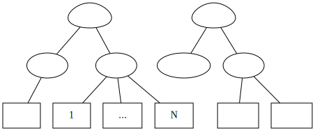
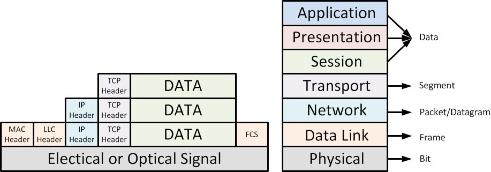
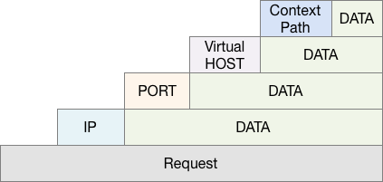
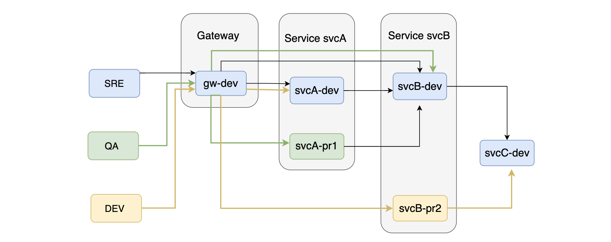

= 多人协作研发环境的设计思路
乔治 <matrix3456@gmail.com>
2022-04-24
:icons: font
:jbake-type: post
:jbake-status: published
:jbake-tags: 研发环境,协作,云原生,虚拟化,容器化,资源隔离
:idprefix:

一般公司的研发环境至少会分为：**开发(dev)**，**测试(test)**和**线上(prod)**。这个大概是开发下意识就会有的基本思路。之所以分环境，主要是为了团队协作顺畅和线上系统稳定。

== 环境划分

从系统稳定性的角度，开发人员可以随时变更开发环境，稳定性最差；测试环境供测试团队使用，或者研发之外的产品，运营团队来测试，验收，要有一定的稳定性；线上或者生产环境是面向真实用户的，稳定性要求最高。对线上环境的变更需要有一定的流程和规范。有些在上线之前还可以有一个**预发布环境(staging)**，此环境是一个准生产环境，使用的资源都是线上的资源，只是服务入口对用户是隐藏的，一般是上线前内部评审使用的环境。这个功能也可以用测试环境代替，但是一般测试环境数据没有线上规范，可能会有部分效果看不到。

从用户的角度，环境可归类为线上和线下两部分。线上环境包含生产和预发布环境，线下环境包含开发和测试环境。开发者一般都需要本机开发调试，所以开发环境又可以多一个**本地(local)环境**。

最后可以组成一个**本地**，**开发**，**测试**，**预发布**和**生产**5个环境。不同的团队规模可以酌情全部使用，或者简化省略一部分环境。最简单的就是维护一个生产环境，开发直接变更生产环境，只是从团队协作和业务稳定的角度看风险非常高。

从团队协作的角度，系统迭代通常会涉及**开发**，**测试**，**运维**，**产品/运营**到最终的**用户/客户**。不同开发之间的工作最好不要互相影响，不同测试之间的工作也不要影响。同时开发最好也不要影响测试工作，反之亦然。因此我们可以在**一个环境内细分为多个分组（sharding/group）**，分组之间可以共用一部分环境，但是在不同分组各自变更的部分是相互独立而不干扰。比如线上环境如果要支持A/B测试的话，那么也可以分为2个组，一个测试组和一个对照组。不同的开发按照不同的功能(feature)为分组各自独立开发、测试和上线。比如一个支付团队在迭代支付服务，电商团队在做购物车的迭代，购物车流程是要用到支付服务的。这时候电商团队和支付团队就可以在开发环境中分别为两个功能分组，各自开发，而不会因为支付团队也在开发状态而影响电商团队的迭代开发。

最终的环境设计为下图的样子：

.环境规划

最后我们可以让不同的环境之间尽可能的保持相似或者一致，然后通过性能指标来调整资源分布，从而保持相似或者一致的前提下避免资源浪费。这样之后研发人员对各个环境会越来越熟悉，对于故障处理等紧急情况下的效率有很大的帮助。

== 落地思路

以上环境的规划，主要是通过各种资源的隔离来实现的。

=== 隔离

区分环境主要是为了隔离，包括代码，数据库，消息队列，应用，负载均衡，基础设施比如机器以及网络环境等。还需要考虑依赖的第三方应用对环境的兼容性，比如第三方支付通道如微信支付不存在测试，应用要测试就是用微信支付线上的环境，线上的商户，线上的签名配置等。

==== 物理隔离

这种隔离使用的是不同的物理机器，不同的部署服务，不同的代码仓库，不同数据库等等。这是物理级别的隔离，颗粒度比较粗的方式。比较常见的，比如把部分机器分配给测试组，其他人不能等。

==== 软件隔离

不过随着虚拟化和容器化，以及云原生的趋势，很多物理资源都可以按需共享，这要就在软件层面实现隔离。常听说的命名空间(namespace)和多路复用(multiplex)理解起来就是软件层面实现的隔离资源。

== 资源

研发中涉及的资源最主要的就是代码和数据。

=== 资源类型

代码:: 现在的SCM主要是git，可以很快速创建轻量级分支(branch)。
配置:: 分布式配置中心，可以每个环境共享一套配置项，应该是没必要做到每个分组一套配置项。
数据库:: 数据库连接字符串，主要是域名、端口设数据库名称。
服务器:: 一般是IP和端口，其中的IP也可以绑定到内部域名。或者使用内部DNS服务来解析域名和IP的配置。
依赖服务:: 主流是HTTP(S) URL，主要构成是域名、端口和context-path，亦或者是service-name等。
负载均衡:: 主流是HTTP(S)，通过域名来使用Virtual Host来区分不同的环境。

=== 资源命名

把资源先按照环境划分，每个环境在按照分组划分，然后形成对应的名字。 这个写出来就是：**分组-环境-资源(sharding-env-resource)**。这只是一个例子，实际上我们可以使用更多的维度来命名，就像TCP协议栈中的数据封装的方式一样，通过不停的打Tag或者加Header的方式继续扩展下去。

.TCP/IP数据封装

如果我们把这些Tag按照一定的顺序连接起来，用容器的术语，我们也是在用**命名空间(namespace)**的概念来隔离资源了。从资源的角度看过去，我们就是在干sharding的事情，就像数据库的分库和分表一样的思路。

=== Tag的方式

常见资源的Tag方式：

- 代码: git branch是一个天然的tag
- 域名：子域名也是直观的的tag，比如tag.domain.com，f1-dev.domain.com, f2-test.domain.com
- HTTP Request:
* Query String: 参数的方式；
* Header: x-shard=f1 or group=tag, env=test or dev；
* Cookie: 跨请求无状态服务之间共享数据的方式；
- Tag metadata: 直接在数据中附带tag元数据。 比如我们常说的对象存储服务，之所以叫对象存储而不是块存储，就是因为对象存储除了数据以外还有一部分元数据。

**命名空间**和另一个概念**多路复用(multiplex)**也有一定的相似性，都是通过命名来区分资源的。如果你是Web开发者的话，理解起来就特别顺，比如一台机器上的不同端口，一个端口上的不同协议，相同协议的不同域名，相同域名中的不同的context-path等等都可以将资源隔离开来而又共享了部分资源。

.应用的多路复用

=== 资源创建与销毁

要做到上面的环境，最好是有一个程序化的创建与销毁各种资源的方式，最好的匹配就是k8s环境。比如说你要使用一个开发域名，需要起一个邮件发申请，等着审核系统逐级审核到最后运维团队在执行的话，就非常的不适用这么灵活的环境。

== 环境与分组（sharding）

这样我们就可以是用最直观的**分组-环境-资源**三个维度来尝试实现一个共享与隔离同时具备的灵活的研发环境。

- 每个功能(feature)都可以作为一个分组，通过代码仓库的分支号来区分；
- 每个功能都可以独立部署到对应的环境中，通过命名机制来在本环境内寻找相应的依赖资源；
- 对应环境中开发此功能涉及到的依赖服务能需要能够共享。

如何共享非变动的资源呢？通过Fallback机制或者动态路由来实现。

=== 服务动态路由

每个环境都需要有一个默认的分组，如果没有指定分组的话，可以使用默认分组。这样我们就可以在Request的经过的服务中根据分组和环境来路由到不通的服务实例，做到环境的隔离和不同角色的稳定协作。

虽说如此，但是环境与环境之间应该要严格隔离的。就是开发环境严格的不能使用测试的数据库，更不能链接线上的数据库。测试数据的规范和覆盖率，数据不完备或者不规范，导致很多逻辑验证不规范，覆盖率不到。会导致很多的时候测试环境没问题，一到线上就有问题的现象。这个可以通过线上数据脱敏之后定期同步到测试环境，而避免在测试环境中直接连接线上数据库。

.服务动态路由

== 总结

基于以上对环境的理解，整个研发环境的设计需要涉及基础设施如网络，域名等，数据库连接字符串，各种中间件，Servlet容器，反向代理等各个环节的适配，从而来构建这个多人协作并行开发的高效环境了。这个过程可以参考SkyWalking等APM服务对开发人员透明的不侵入应用的集成方案。

== 参考

* Sharma Rajesh, https://engineering.mercari.com/en/blog/entry/20220218-dynamic-service-routing-using-istio/[Dynamic Service Routing using Istio]

* Packet Networking, http://packet-network.blogspot.com/2011/11/data-encapsulation.html[Data Encapsulation ]