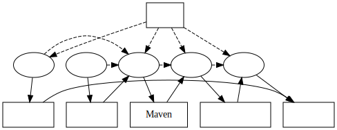

= 服务开发的几个原则
乔治 <matrix3456@gmail.com>
2022-05-17
:icons: font
:jbake-type: post
:jbake-status: published
:jbake-tags: 微服务,持续集成,持续部署,构建,研发环境,分布式配置中心
:idprefix:

开发服务类系统大体上分为以下几个步骤：`编码|配置|打包|构建|部署`。这个过程中涉及环境，代码，配置，构建、打包产出物，到最后的运行环境。

这里面的环境是一个静态配置，一般来说就是本地（local），开发（dev），测试（test），预发（staging）和生产环境（prod），更多的是用来标识与选择环境。可参考xref:../04/rd-env.adoc[研发环境的设计思路]了解更多。

每个步骤的结构都独立持久化到对应的存储中，作为后面步骤中的输入，像极了管道(Pipeline)的工作方式。

== 几个原则

. 代码和配置分离
* 代码只关注业务逻辑，不用操心部署环境以及静态配置
. 环境需要的配置交给分布式配置中心来管理
* 配置集中管理
. 代码编译打包为目标环境的机器码
* 所需要的配置最小化，比如环境的选择，Profile的指定等
. 构建服务将根据目标环境构建可部署的包
* 将上一步中基本打包结果构建为容器化的镜像
. 部署服务交给专门的CD部署系统来统一规划
* 发布与回滚都基于镜像来操作
. 运行时通过分布式配置服务加载环境配置
* 配置中心来回避配置散落到代码中，因为配置比代码变化更频繁

== 结论

研发划分的粒度越细，需要的职责也多，相应的人也会多一些。