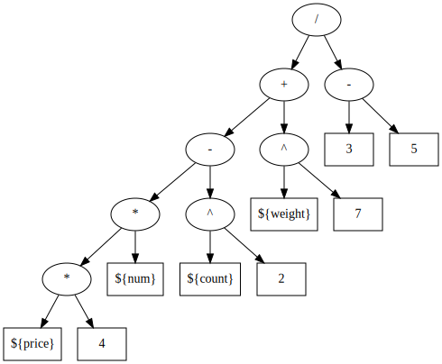

= MyBatis Mapper中的SQL生成
乔治 <matrix3456@gmail.com>
2022-06-24
:icons: font
:jbake-type: post
:jbake-status: draft
:jbake-tags: Ognl,SQL,MyBatis,优先级,表达式求值,实体关系图,实体关系图
:idprefix:
:toc:

MyBatis作为和Hibernate相比来说一个轻量并且非常灵活的ORM框架，见过的Java项目中大部分都是使用MyBatis。MyBatis再运行时是支持日志输出SQL语句的，进而可以通过SQL做一些分析。如果要再编译时期做一些就像Java语言的静态分析之类的事情，通过解析XML的文件也是一个办法。本文通过项目**https://github.com/reploop/mybatis-sql-dump[mybatis-sql-dump]**来介绍一下如何从xml中生成SQL语句。

现在数据库设计越来越的不遵守范式，数据库之间的主键和外键约束关系都不会落到数据库中，而是再应用程序中。那么再数据库中大部分情况下下看到的就是一些简单而独立的表，表之间的关系都弱化了，只有客户端SQL语句执行的时候才知道涉及表之间的约束关系。通过联合查询类的SQL来推断表之间的约束关系是本文的第二个目的。

== MyBatis工作机制

MyBatis通过解析XML，通过``namespace``将XML文件和Java接口联系起来。然后将XML中的SQL语句解析为``MappedStatement``，并通过其id属性值和Java接口中的方法名对应起来，随后用生成代理的方式为接口中的每个方法行程代理，方法被调用的时候再通过方法名反向映射到XML中的SQL语句并执行。

[source,xml]
----
<?xml version="1.0" encoding="UTF-8" ?>
<!DOCTYPE mapper PUBLIC "-//mybatis.org//DTD Mapper 3.0//EN" "http://mybatis.org/dtd/mybatis-3-mapper.dtd" >
<mapper namespace="org.reploop.mapper.EntityMapper">    <1>
    <select id="selectAll" resultMap="BaseResultMap">   <2>
        select *
        from tb_entity
    </select>
</mapper>
----

[source,java]
----
package org.reploop.mapper;
class Entity {
    // Properties
}
public interface EntityMapper {
    List<Entity> selectAll();   // <2>
}
----

<1> namespace就是Java中的Mapper接口
<2> xml中id对应Java接口中的方法

== 生成SQL

SQL语句是在解析生成``MappedStatement``的过程中解析并生成SqlSource，然后通过其方法：

[source,java]
----
BoundSql getBoundSql(Object parameterObject);
----

能得到一个BoundSql实例，最后``BoundSql.getSql()``就得到了SQL语句。

如果我们再xml里面写的就是单纯的sql语句，那么到这里就结束了。实际上MyBatis还通过Ognl支持通过表达式求值的方式来根据入参来动态的调整sql语句的输出。

=== SqlSource

SqlSource实质上是一个树形结构，体现了XML的嵌套结果的解析结果，然后执行``getBoundSql``的时候可以看作是层序遍历这个树，并且通过入参作为输入，对Ognl表达式进行求值(或者绑定变量)后的结果就是sql语句了。

这个下面这个select语句中：

[source,xml]
----
<select>
select * from ${tableName} where deleted = 0 <1>
<if test="userId != null"> <2>
    and user_id = #{userId,jdbcType=INTEGER}
</if>
</select>
----

<1> $\{tableName\}这个变量再SQL语句生成阶段就会替换为入参中ableName这个变量的值；
<2> 这个test内容是一个ognl表达式，只有入参中userId不为null的情况下，也就是表达式求值为真的情况下where子句中的第2个条件才会生效

因此我们要生成完整的SQL语句，就需要解析这个表达式，收集表达式中需要的变量，以及为了能够让表达式求值结果为真，给变量合适的值。这样我们就需要解析Ognl表达式，并且走一遍表达式求值，从而推断出合适的变量值。

=== Ognl表达式

MyBatis集成了Ognl表达式的解析，解析完之后同样也是一个表达式语法树(AST)，而且是带有操作符的语法树。Ognl表达式中的操作大部分情况下最多是2个操作数，所以这个语法树也可以是一颗二叉树。

=== 表达式求值

拿到表达式树之后，我们可用深度优先遍历(Depth-First Search)的方式遍历这棵树，并在遍历的过程中收集变量，并根据其操作觉得该变量的值，使得表达式求值结果为真。

其实深度优先遍历的输出就是操作树的**后缀表达式**，而后缀表达式的求值则使用双栈(Stack)，一个操作符栈，一个操作数栈遍历一遍就可以完成求值。一般的大学数据结构课程肯定是学过的。

== 实体关系图(ER-Diagram)

得到合法SQL之后就可以利用SQL解析器**https://github.com/JSQLParser/JSqlParser[JSqlParser]**分析，并通过JOIN语法来推断数据库表之间的主键和外键约束关系，之后通过**graphviz**来生成可视化的图片。

== 结论

本文本是想通过现成的MyBatis框架本身就解析xml文件，而不是从0开始写一个解析符合MyBatis的规范的xml解析器，这个过程有一个不太完美的地方，就是如果xml中依赖了项目中的类，比如MyBatis的ParameterType，ResultMap或则typeHandler是个业务自定义的实现类，那么这个过程是需要把这些类都加入到classpath中去的，这样才能再正确运行。

我们可以通过定制classloader的方式来解决，不过前提是xml的mapper所在的项目需要提前编译好，这样才能通过定制classloader的方式指定搜索路径，来支持类的加载。

== 参考

* JSqlParser, https://github.com/JSQLParser/JSqlParser[JSqlParser]
