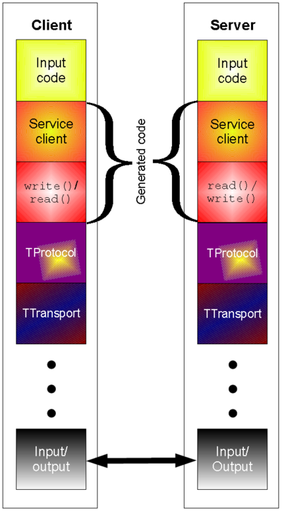

= Thrift的坑
:toc:

Thrift作为一个经常拿来和Google的Protocol Buffers比较的二进制协议阵营中的重量级选手，我认为其最大的特点就是有个完整的RPC协议栈，而Protocol Buffers开源出来的版本基本上可以认为仅仅是个跨平台的数据序列化/反序列化的工具。

图片来自Wikipedia

也是基于最大的理由，我们在RPC环境下选择了Thrift。但是在使用Thrift的过程中也逐渐发现她的一些问题。

集合（list，set，map）里面不能有null值
这点使用Java语言来讲，要特别注意。Thrift本身使用的Java的ArrayList，HashSet，HashMap这些数据结构分别实现list，set和map。从Java的语义来讲，ArrayList里面是允许有null值的，HashMap的键（key）和值（value）都是允许有null值的，而HashSet内部是用了一个HashMap来实现的，同样也是允许有null值的。
[code=java]
----
    // HashMap
    Map<String, String> map = new HashMap<>();
    map.put(null, null);
    assert(1 == map.size());

    // HashSet
    Set<String> set = new HashSet<>();
    set.add(null);
    assert(1 == set.size());
----

枚举类型（enum）不能做map的key
枚举类型不要用在任何容器类里面，比如map，set，list中一旦出现enum类型，如果enum扩展了，增加了一个新值。那么就需要所有的客户端先升级，代价比较大。

字符串不能压缩
实际上Thrift是有TCompactProtocol的，但是这个Protocol做的大部分工作是数值的编码工作以减少数据量。但是实际业务中，往往字符串传输占了非常大的比例。针对字符串的压缩，Thrift并没有原生的支持。自己扩展Protocol支持字符串压缩也不是很方面。

传输协议不支持动态探测
不支持service multiplexing

Header头部支持
对的

JSON序列化输出
枚举值做key，返回的数值，产生了不标准JSON。

Java类库代码质量不好
不要
