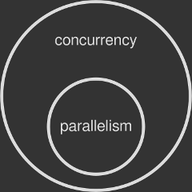

= 多线程简介
:toc:

Approaching the world of concurrency, one step at a time.
一步一步走进并发的世界。

Modern computers have the ability to perform multiple operations at the same time. Supported by hardware advancements and smarter operating systems, this feature makes your programs run faster, both in terms of speed of execution and responsiveness.

现代计算机有同时执行多个的能力。在高级硬件和聪明的操作系统的支持下，计算机的这个能力能够让你的程序在执行速度和响应时间方面执行的更快。

Writing software that takes advantage of such power is fascinating, yet tricky: it requires you to understand what happens under your computer's hood. In this first episode I'll try to scratch the surface of threads, one of the tools provided by operating systems to perform this kind of magic. Let's go!

开发利用这个能力的软件是有趣且有技巧性的：它要求你理解计算机的底层细节。系列的第一篇文章中，我尝试浅显介绍一下线程（thread）。这是操作系统提供的开发多线程程序的工具之一。

== Processes and threads: naming things the right way
== 进程与线程：用正确的方式命名

Modern operating systems can run multiple programs at the same time. That's why you can read this article in your browser (a program) while listening to music on your media player (another program). Each program is known as a process that is being executed. The operating system knows many software tricks to make a process run along with others, as well as taking advantage from the underlying hardware. Either way, the final outcome is that you sense all your programs to be running simultaneously.

现代操作系统能够同时执行多个程序。这就是你在用浏览器（一个程序）看这篇文章的同时还能够用多媒体播放器（另一个程序）听音乐的原因。每个程序就是一个正在被执行的进程（process）。操作系统知道很多技巧是的多个程序并行执行。更好的利用底层的硬件。不管那种方式，最终结果就是你感觉到所有的程序就是同时运行的。

Running processes in an operating system is not the only way to perform several operations at the same time. Each process is able to run simultaneous sub-tasks within itself, called threads. You can think of a thread as a slice of the process itself. Every process triggers at least one thread on startup, which is called the main thread. Then, according to the program/programmer's needs, additional threads may be started or terminated. Multithreading is about running multiple threads within a single process.

For example, it is likely that your media player runs multiple threads: one for rendering the interface — this is usually the main thread, another one for playing the music and so on.

You can think of the operating system as a container that holds multiple processes, where each process is a container that holds multiple threads. In this article I will focus on threads only, but the whole topic is fascinating and deserves more in-depth analysis in the future.

image::images/processes-threads.png[Processes vs Threads]
1. 操作系统可看作高包含多个进程的盒子，而进程则是包含了至少一个线程的盒子

=== The differences between processes and threads
=== 进程与线程的不同之处

Each process has its own chunk of memory assigned by the operating system. By default that memory cannot be shared with other processes: your browser has no access to the memory assigned to your media player and vice versa. The same thing happens if you run two instances of the same process, that is if you launch your browser twice. The operating system treats each instance as a new process with its own separate portion of memory assigned. So, by default, two or more processes have no way to share data, unless they perform advanced tricks — the so-called inter-process communication (IPC).

每个进程

Unlike processes, threads share the same chunk of memory assigned to their parent process by the operating system: data in the media player main interface can be easily accessed by the audio engine and vice versa. Therefore is easier for two threads to talk to eachother. On top of that, threads are usually lighter than a process: they take less resources and are faster to create, that's why they are also called lightweight processes.

Threads are a handy way to make your program perform multiple operations at the same time. Without threads you would have to write one program per task, run them as processes and synchronize them through the operating system. This would be more difficult (IPC is tricky) and slower (processes are heavier than threads).

=== Green threads, of fibers
=== 绿色线程，或者
Threads mentioned so far are an operating system thing: a process that wants to fire a new thread has to talk to the operating system. Not every platform natively support threads, though. Green threads, also known as fibers are a kind of emulation that makes multithreaded programs work in environments that don't provide that capability. For example a virtual machine might implement green threads in case the underlying operating system doesn't have native thread support.

Green threads are faster to create and to manage because they completely bypass the operating system, but also have disadvantages. I will write about such topic in one of the next episodes.

The name "green threads" refers to the Green Team at Sun Microsystem that designed the original Java thread library in the 90s. Today Java no longer makes use of green threads: they switched to native ones back in 2000. Some other programming languages — Go, Haskell or Rust to name a few — implement equivalents of green threads instead of native ones.

== What threads are used for

Why should a process employ multiple threads? As I mentioned before, doing things in parallel greatly speeds up things. Say you are about to render a movie in your movie editor. The editor could be smart enough to spread the rendering operation across multiple threads, where each thread processes a chunk of the final movie. So if with one thread the task would take, say, one hour, with two threads it would take 30 minutes; with four threads 15 minutes, and so on.

Is it really that simple? There are three important points to consider:

not every program needs to be multithreaded. If your app performs sequential operations or often waits on the user to do something, multithreading might not be that beneficial;
you just don't throw more threads to an application to make it run faster: each sub-task has to be thought and designed carefully to perform parallel operations;
it is not 100% guaranteed that threads will perform their operations truly in parallel, that is at the same time: it really depends on the underlying hardware.
The last one is crucial: if your computer doesn't support multiple operations at the same time, the operating system has to fake them. We will see how in a minute. For now let's think of concurrency as the perception of having tasks that run at the same time, while true parallelism as tasks that literally run at the same time.


2. Parallelism is a subset of concurrency.

== What makes concurrency and parallelism possible
== 并发和并行的原理

The central processing unit (CPU) in your computer does the hard work of running programs. It is made of several parts, the main one being the so-called core: that's where computations are actually performed. A core is capable of running only one operation at a time.

This is of course a major drawback. For this reason operating systems have developed advanced techniques to give the user the ability to running multiple processes (or threads) at once, especially on graphical environments, even on a single core machine. The most important one is called preemptive multitasking, where preemption is the ability of interrupting a task, switching to another one and then resuming the first task at a later time.

So if your CPU has only one core, part of a operating system's job is to spread that single core computing power across multiple processes or threads, which are executed one after the other in a loop. This operation gives you the illusion of having more than one program running in parallel, or a single program doing multiple things at the same time (if multithreaded). Concurrency is met, but true parallelism — the ability to run processes simultaneously — is still missing.

Today modern CPUs have more than one core under the hood, where each one performs an independent operation at a time. This means that with two or more cores true parallelism is possible. For example, my Intel Core i7 has four cores: it can run four different processes or threads at the same time, simultaneously.

Operating systems are able to detect the number of CPU cores and assign processes or threads to each one of them. A thread may be allocated to whatever core the operating system likes, and this kind of scheduling is completely transparent for the program being run. Additionally, preemptive multitasking might kick in in case all cores are busy. This gives you the ability to run more processes and threads than the actual number or cores available in your machine.

=== Multi-threading application on a single core: does it make sense?

True parallelism on a single-core machine is impossible to achieve. Nevertheless it still makes sense to write a multithreaded program, if your application can benefit from it. When a process employs multiple threads, preemptive multitasking can keep the app running even if one of those threads performs a slow or blocking task.

Say for example you are working on a desktop app that reads some data from a very slow disk. If you write the program with just one thread, the whole app would freeze until the disk operation is finished: the CPU power assigned to the only thread is wasted while waiting for the disk to wake up. Of course the operating system is running many other processes besides this one, but your specific application will not be making any progress.

Let's rethink your app in a multithreaded way. Thread A is responsible for the disk access, while thread B takes care of the main interface. If thread A gets stuck waiting because the device is slow, thread B can still run the main interface, keeping your program responsive. This is possible because, having two threads, the operating system can switch the CPU resources between them without getting stuck on the slower one.


 
== More threads, more problems
== 线程越多，问题越多

As we know, threads share the same chunk of memory of their parent process. This makes extremely easy for two or more of them to exchange data within the same application. For example: a movie editor might hold a big portion of shared memory containing the video timeline. Such shared memory is being read by several worker threads designated for rendering the movie to a file. They all just need a handle (e.g. a pointer) to that memory area in order to read from it and output rendered frames to disk.

Things run smoothly as long as two or more threads read from the same memory location. The troubles kick in when at least one of them writes to the shared memory, while others are reading from it. Two problems can occur at this point:

data race — while a writer thread modifies the memory, a reader thread might be reading from it. If the writer has not finished its work yet, the reader will get corrupted data;

race condition — a reader thread is supposed to read only after a writer has written. What if the opposite happens? More subtle than a data race, a race condition is about two or more threads doing their job in an unpredictable order, when in fact the operations should be performed in the proper sequence to be done correctly. Your program can trigger a race condition even if it has been protected against data races.

=== The concept of thread safety
=== 线程安全性的概念


A piece of code is said to be thread-safe if it works correctly, that is without data races or race conditions, even if many threads are executing it simultaneously. You might have noticed that some programming libraries declare themselves as being thread-safe: if you are writing a multithreaded program you want to make sure that any other third-party function can be used across different threads without triggering concurrency problems.

== The root cause of data races
== 数据竞争的根本原因

We know that a CPU core can perform only one machine instruction at a time. Such instruction is said to be atomic because it's indivisible: it can't be broken into smaller operations. The Greek word "atom" (ἄτομος; atomos) means uncuttable.

The property of being indivisible makes atomic operations thread-safe by nature. When a thread performs an atomic write on shared data, no other thread can read the modification half-complete. Conversely, when a thread performs an atomic read on shared data, it reads the entire value as it appeared at a single moment in time. There is no way for a thread to slip through an atomic operation, thus no data race can happen.

The bad news is that the vast majority of operations out there are non-atomic. Even a trivial assignment like x = 1 on some hardware might be composed of multiple atomic machine instructions, making the assignment itself non-atomic as a whole. So a data race is triggered if a thread reads x while another one performs the assignment.

== The root cause of race conditions
== 竞争条件的根本原因

Preemptive multitasking gives the operating system full control over thread management: it can start, stop and pause threads according to advanced scheduling algorithms. You as a programmer cannot control the time or order of execution. In fact, there is no guarantee that a simple code like this:
```C
writer_thread.start()
reader_thread.start()
```
would start the two threads in that specific order. Run this program several times and you will notice how it behaves differently on each run: sometimes the writer thread starts first, sometimes the reader does instead. You will surely hit a race condition if your program needs the writer to always run before the reader.

This behavior is called non-deterministic: the outcome changes each time and you can't predict it. Debugging programs affected by a race condition is very annoying because you can't always reproduce the problem in a controlled way.

== Teach threads to get along: concurrency control
== 让线程和平共处：并发控制

Both data races and race conditions are real-world problems: some people even died because of them. The art of accommodating two or more concurrent threads is called concurrency control: operating systems and programming languages offer several solutions to take care of it. The most important ones:

* synchronization — a way to ensure that resources will be used by only one thread at a time. Synchronization is about marking specific parts of your code as "protected" so that two or more concurrent threads do not simultaneously execute it, screwing up your shared data;

* atomic operations — a bunch of non-atomic operations (like the assignment mentioned before) can be turned into atomic ones thanks to special instructions provided by the operating system. This way the shared data is always kept in a valid state, no matter how other threads access it;

* immutable data — shared data is marked as immutable, nothing can change it: threads are only allowed to read from it, eliminating the root cause. As we know threads can safely read from the same memory location as long as they don't modify it. This is the main philosophy behind functional programming.

I will cover all this fascinating topics in the next episodes of this mini-series about concurrency. Stay tuned!

== Sources
== 参考
8 bit avenue - Difference between Multiprogramming, Multitasking, Multithreading and Multiprocessing
Wikipedia - Inter-process communication
Wikipedia - Process (computing)
Wikipedia - Concurrency (computer science)
Wikipedia - Parallel computing
Wikipedia - Multithreading (computer architecture)
Stackoverflow - Threads & Processes Vs MultiThreading & Multi-Core/MultiProcessor: How they are mapped?
Stackoverflow - Difference between core and processor?
Wikipedia - Thread (computing)
Wikipedia - Computer multitasking
Ibm.com - Benefits of threads
Haskell.org - Parallelism vs. Concurrency
Stackoverflow - Can multithreading be implemented on a single processor system?
HowToGeek - CPU Basics: Multiple CPUs, Cores, and Hyper-Threading Explained
Oracle.com - 1.2 What is a Data Race?
Jaka's corner - Data race and mutex
Wikipedia - Thread safety
Preshing on Programming - Atomic vs. Non-Atomic Operations
Wikipedia - Green threads
Stackoverflow - Why should I use a thread vs. using a process?

