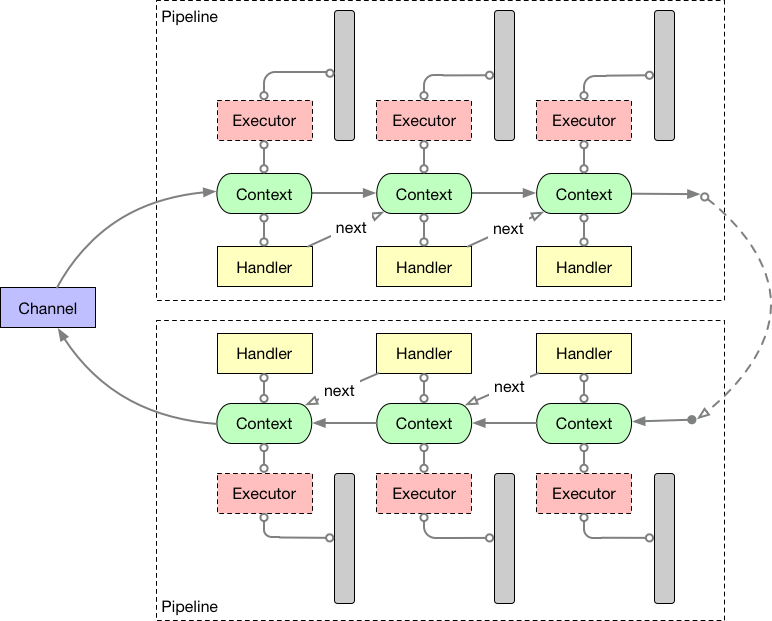

= Netty 4 线程模型
George Cao <matrix3456@gmail.com>
2017-06-03
:toc: 

[abstract]
Netty 4的线程模型简单可依赖

https://medium.com/square-corner-blog/upgrading-a-reverse-proxy-from-netty-3-to-4-878ec407665a#.yyrawts8y

EventLoop -> EventExecutor Lazy Bind
http://www.infoq.com/cn/articles/netty-version-upgrade-history-thread-part

== 工作原理
每个EventExecutor都会绑定唯一的一个线程，并且可以有0或者1个工作队列（EventLoop）。提交任务的时候将任务放去工作队列，而绑定的线程则不停地轮询（Loop）工作队列，如何有任务则执行，没有就等待，直到Executor关闭才退出循环。EventExecutor和JDK中的线程池Executor非常类似的思想。

== 延迟绑定
EventExecutor 第一次执行任务的时候，使用ThreadPerTaskExecutor创建一个新线程，并且绑定到这个EventExecutor。ThreadPerTaskExecutor非常特殊，没有工作队列，每个任务都是新创建一个线程去执行，顾名思义。而当前任务呢将作为这个线程的第一个任务去执行。一般来讲绑定任务都是个无限循环，不停地从当前的Executor的任务队列中拉取任务执行，直到停止或者关闭的时候才结束。

== 多线程环境
每个Handler可以显式绑定一个Executor，如果没有绑定的话，就使用Channel默认绑定的EventLoop执行。每个Handler执行任何Read或者Write操作都会检查当前Executor和绑定的是否一致，如果一致的话，单线程直接执行任务；不一致，当前Executor将把操作封装成一个任务提交到下一个Executor的任务队列中。

Netty中默认都是使用的I/O线程，也就是Worker线程去执行任务，如果你的Handler里面有耗时任务，比如常见的网络操作，在加上一个EventLoop可以绑定到多个Channel，那么强烈建议给这个Handler显式绑定一个EventExecutorGroup，使得I/O线程能够继续处理I/O操作。如果阻塞当前线程的话，1个或者多个Channel将被阻塞，从而严重影响吞吐量。

EventExecutor上创建的Promise或者Future，当前线程是用来阻塞等待的（wait/notify机制），实现的效果就是谁调用阻塞方法，就阻塞谁。但是当Promise和Future完成（notify）之后，是用这个EventExecutor去通知所有的监听者。

EventExecutor可以看做一个普通的线程，去执行业务任务。EventLoop作为EventExecutor的特例，只用来执行I/O相关任务，因此也不能被阻塞。

NIO模式下，Netty中Channel和JVM的Channel是通过附件attachment关联起来的。

ByteBuf要在同一个线程里面创建和回收，从而避免内存泄露。因为ByteBuf Pool用的是ThreadLocal实现的。

.Thread任务执行模型

I/O密集型和CPU密集型
这种线程模型针对这两类业务类型的优缺点

http://netty.io/wiki/new-and-noteworthy-in-4.0.html
